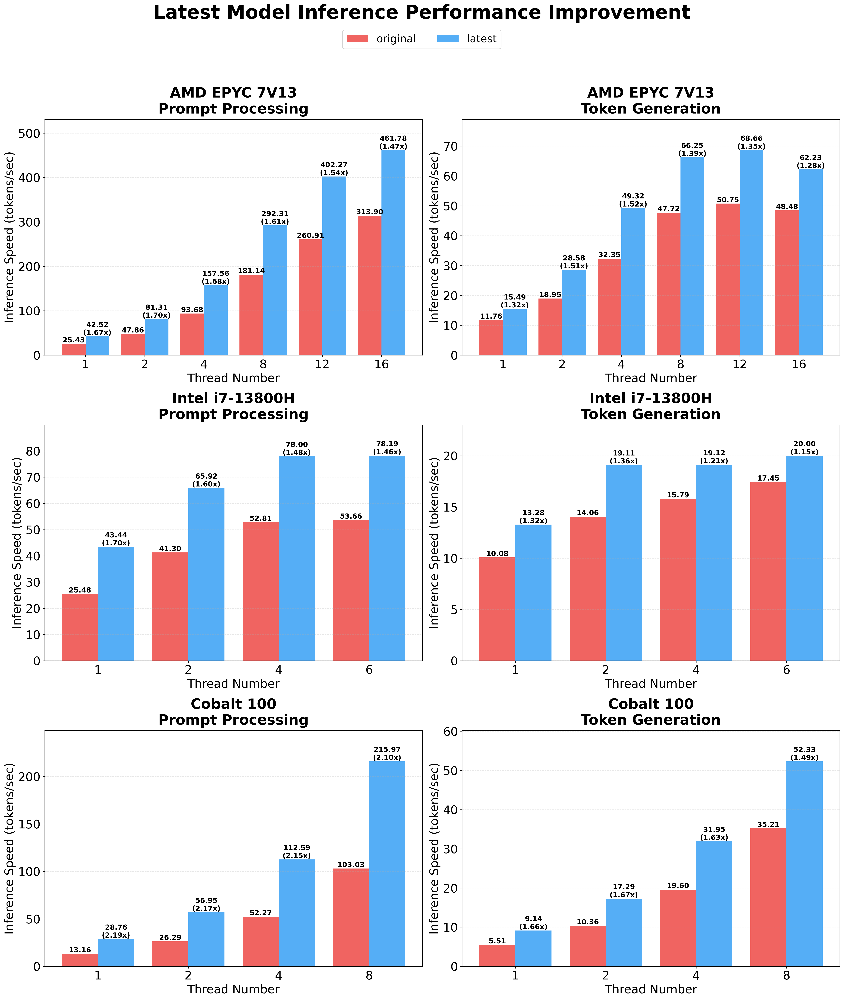

# bitnet.cpp
[](https://opensource.org/licenses/MIT)


[](https://huggingface.co/microsoft/BitNet-b1.58-2B-4T)

Try it out via this [demo](https://demo-bitnet-h0h8hcfqeqhrf5gf.canadacentral-01.azurewebsites.net/), or build and run it on your own [CPU](https://github.com/microsoft/BitNet?tab=readme-ov-file#build-from-source) or [GPU](https://github.com/microsoft/BitNet/blob/main/gpu/README.md).

bitnet.cpp is the official inference framework for 1-bit LLMs (e.g., BitNet b1.58). It offers a suite of optimized kernels, that support **fast** and **lossless** inference of 1.58-bit models on CPU and GPU (NPU support will coming next).

The first release of bitnet.cpp is to support inference on CPUs. bitnet.cpp achieves speedups of **1.37x** to **5.07x** on ARM CPUs, with larger models experiencing greater performance gains. Additionally, it reduces energy consumption by **55.4%** to **70.0%**, further boosting overall efficiency. On x86 CPUs, speedups range from **2.37x** to **6.17x** with energy reductions between **71.9%** to **82.2%**. Furthermore, bitnet.cpp can run a 100B BitNet b1.58 model on a single CPU, achieving speeds comparable to human reading (5-7 tokens per second), significantly enhancing the potential for running LLMs on local devices. Please refer to the [technical report](https://arxiv.org/abs/2410.16144) for more details.

**Latest optimization** introduces parallel kernel implementations with configurable tiling and embedding quantization support, achieving **1.15x to 2.1x** additional speedup over the original implementation across different hardware platforms and workloads. For detailed technical information, see the [optimization guide](src/README.md).




## Demo

A demo of bitnet.cpp running a BitNet b1.58 3B model on Apple M2:

https://github.com/user-attachments/assets/7f46b736-edec-4828-b809-4be780a3e5b1

## What's New:
- 01/15/2026 [BitNet CPU Inference Optimization](https://github.com/microsoft/BitNet/blob/main/src/README.md) 
- 05/20/2025 [BitNet Official GPU inference kernel](https://github.com/microsoft/BitNet/blob/main/gpu/README.md)
- 04/14/2025 [BitNet Official 2B Parameter Model on Hugging Face](https://huggingface.co/microsoft/BitNet-b1.58-2B-4T)
- 02/18/2025 [Bitnet.cpp: Efficient Edge Inference for Ternary LLMs](https://arxiv.org/abs/2502.11880)
- 11/08/2024 [BitNet a4.8: 4-bit Activations for 1-bit LLMs](https://arxiv.org/abs/2411.04965)
- 10/21/2024 [1-bit AI Infra: Part 1.1, Fast and Lossless BitNet b1.58 Inference on CPUs](https://arxiv.org/abs/2410.16144)
- 10/17/2024 bitnet.cpp 1.0 released.
- 03/21/2024 [The-Era-of-1-bit-LLMs__Training_Tips_Code_FAQ](https://github.com/microsoft/unilm/blob/master/bitnet/The-Era-of-1-bit-LLMs__Training_Tips_Code_FAQ.pdf)
- 02/27/2024 [The Era of 1-bit LLMs: All Large Language Models are in 1.58 Bits](https://arxiv.org/abs/2402.17764)
- 10/17/2023 [BitNet: Scaling 1-bit Transformers for Large Language Models](https://arxiv.org/abs/2310.11453)

## Acknowledgements

This project is based on the [llama.cpp](https://github.com/ggerganov/llama.cpp) framework. We would like to thank all the authors for their contributions to the open-source community. Also, bitnet.cpp's kernels are built on top of the Lookup Table methodologies pioneered in [T-MAC](https://github.com/microsoft/T-MAC/). For inference of general low-bit LLMs beyond ternary models, we recommend using T-MAC.
## Official Models
<table>
    </tr>
    <tr>
        <th rowspan="2">Model</th>
        <th rowspan="2">Parameters</th>
        <th rowspan="2">CPU</th>
        <th colspan="3">Kernel</th>
    </tr>
    <tr>
        <th>I2_S</th>
        <th>TL1</th>
        <th>TL2</th>
    </tr>
    <tr>
        <td rowspan="2"><a href="https://huggingface.co/microsoft/BitNet-b1.58-2B-4T">BitNet-b1.58-2B-4T</a></td>
        <td rowspan="2">2.4B</td>
        <td>x86</td>
        <td>&#9989;</td>
        <td>&#10060;</td>
        <td>&#9989;</td>
    </tr>
    <tr>
        <td>ARM</td>
        <td>&#9989;</td>
        <td>&#9989;</td>
        <td>&#10060;</td>
    </tr>
</table>

## Supported Models
❗️**We use existing 1-bit LLMs available on [Hugging Face](https://huggingface.co/) to demonstrate the inference capabilities of bitnet.cpp. We hope the release of bitnet.cpp will inspire the development of 1-bit LLMs in large-scale settings in terms of model size and training tokens.**

<table>
    </tr>
    <tr>
        <th rowspan="2">Model</th>
        <th rowspan="2">Parameters</th>
        <th rowspan="2">CPU</th>
        <th colspan="3">Kernel</th>
    </tr>
    <tr>
        <th>I2_S</th>
        <th>TL1</th>
        <th>TL2</th>
    </tr>
    <tr>
        <td rowspan="2"><a href="https://huggingface.co/1bitLLM/bitnet_b1_58-large">bitnet_b1_58-large</a></td>
        <td rowspan="2">0.7B</td>
        <td>x86</td>
        <td>&#9989;</td>
        <td>&#10060;</td>
        <td>&#9989;</td>
    </tr>
    <tr>
        <td>ARM</td>
        <td>&#9989;</td>
        <td>&#9989;</td>
        <td>&#10060;</td>
    </tr>
    <tr>
        <td rowspan="2"><a href="https://huggingface.co/1bitLLM/bitnet_b1_58-3B">bitnet_b1_58-3B</a></td>
        <td rowspan="2">3.3B</td>
        <td>x86</td>
        <td>&#10060;</td>
        <td>&#10060;</td>
        <td>&#9989;</td>
    </tr>
    <tr>
        <td>ARM</td>
        <td>&#10060;</td>
        <td>&#9989;</td>
        <td>&#10060;</td>
    </tr>
    <tr>
        <td rowspan="2"><a href="https://huggingface.co/HF1BitLLM/Llama3-8B-1.58-100B-tokens">Llama3-8B-1.58-100B-tokens</a></td>
        <td rowspan="2">8.0B</td>
        <td>x86</td>
        <td>&#9989;</td>
        <td>&#10060;</td>
        <td>&#9989;</td>
    </tr>
    <tr>
        <td>ARM</td>
        <td>&#9989;</td>
        <td>&#9989;</td>
        <td>&#10060;</td>
    </tr>
    <tr>
        <td rowspan="2"><a href="https://huggingface.co/collections/tiiuae/falcon3-67605ae03578be86e4e87026">Falcon3 Family</a></td>
        <td rowspan="2">1B-10B</td>
        <td>x86</td>
        <td>&#9989;</td>
        <td>&#10060;</td>
        <td>&#9989;</td>
    </tr>
    <tr>
        <td>ARM</td>
        <td>&#9989;</td>
        <td>&#9989;</td>
        <td>&#10060;</td>
    </tr>
    <tr>
        <td rowspan="2"><a href="https://huggingface.co/collections/tiiuae/falcon-edge-series-6804fd13344d6d8a8fa71130">Falcon-E Family</a></td>
        <td rowspan="2">1B-3B</td>
        <td>x86</td>
        <td>&#9989;</td>
        <td>&#10060;</td>
        <td>&#9989;</td>
    </tr>
    <tr>
        <td>ARM</td>
        <td>&#9989;</td>
        <td>&#9989;</td>
        <td>&#10060;</td>
    </tr>
</table>


## Installation

### Requirements
- python>=3.9
- cmake>=3.22
- clang>=18
    - For Windows users, install [Visual Studio 2022](https://visualstudio.microsoft.com/downloads/). In the installer, toggle on at least the following options(this also automatically installs the required additional tools like CMake):
        -  Desktop-development with C++
        -  C++-CMake Tools for Windows
        -  Git for Windows
        -  C++-Clang Compiler for Windows
        -  MS-Build Support for LLVM-Toolset (clang)
    - For Debian/Ubuntu users, you can download with [Automatic installation script](https://apt.llvm.org/)

        `bash -c "$(wget -O - https://apt.llvm.org/llvm.sh)"`
- conda (highly recommend)

### Build from source

> [!IMPORTANT]
> If you are using Windows, please remember to always use a Developer Command Prompt / PowerShell for VS2022 for the following commands. Please refer to the FAQs below if you see any issues.

1. Clone the repo
```bash
git clone --recursive https://github.com/microsoft/BitNet.git
cd BitNet
```
2. Install the dependencies
```bash
# (Recommended) Create a new conda environment
conda create -n bitnet-cpp python=3.9
conda activate bitnet-cpp

pip install -r requirements.txt
```
3. Build the project
```bash
# Manually download the model and run with local path
huggingface-cli download microsoft/BitNet-b1.58-2B-4T-gguf --local-dir models/BitNet-b1.58-2B-4T
python setup_env.py -md models/BitNet-b1.58-2B-4T -q i2_s

```
<pre>
usage: setup_env.py [-h] [--hf-repo {1bitLLM/bitnet_b1_58-large,1bitLLM/bitnet_b1_58-3B,HF1BitLLM/Llama3-8B-1.58-100B-tokens,tiiuae/Falcon3-1B-Instruct-1.58bit,tiiuae/Falcon3-3B-Instruct-1.58bit,tiiuae/Falcon3-7B-Instruct-1.58bit,tiiuae/Falcon3-10B-Instruct-1.58bit}] [--model-dir MODEL_DIR] [--log-dir LOG_DIR] [--quant-type {i2_s,tl1}] [--quant-embd]
                    [--use-pretuned]

Setup the environment for running inference

optional arguments:
  -h, --help            show this help message and exit
  --hf-repo {1bitLLM/bitnet_b1_58-large,1bitLLM/bitnet_b1_58-3B,HF1BitLLM/Llama3-8B-1.58-100B-tokens,tiiuae/Falcon3-1B-Instruct-1.58bit,tiiuae/Falcon3-3B-Instruct-1.58bit,tiiuae/Falcon3-7B-Instruct-1.58bit,tiiuae/Falcon3-10B-Instruct-1.58bit}, -hr {1bitLLM/bitnet_b1_58-large,1bitLLM/bitnet_b1_58-3B,HF1BitLLM/Llama3-8B-1.58-100B-tokens,tiiuae/Falcon3-1B-Instruct-1.58bit,tiiuae/Falcon3-3B-Instruct-1.58bit,tiiuae/Falcon3-7B-Instruct-1.58bit,tiiuae/Falcon3-10B-Instruct-1.58bit}
                        Model used for inference
  --model-dir MODEL_DIR, -md MODEL_DIR
                        Directory to save/load the model
  --log-dir LOG_DIR, -ld LOG_DIR
                        Directory to save the logging info
  --quant-type {i2_s,tl1}, -q {i2_s,tl1}
                        Quantization type
  --quant-embd          Quantize the embeddings to f16
  --use-pretuned, -p    Use the pretuned kernel parameters
</pre>
## Usage
### Basic usage
```bash
# Run inference with the quantized model
python run_inference.py -m models/BitNet-b1.58-2B-4T/ggml-model-i2_s.gguf -p "You are a helpful assistant" -cnv
```
<pre>
usage: run_inference.py [-h] [-m MODEL] [-n N_PREDICT] -p PROMPT [-t THREADS] [-c CTX_SIZE] [-temp TEMPERATURE] [-cnv]

Run inference

optional arguments:
  -h, --help            show this help message and exit
  -m MODEL, --model MODEL
                        Path to model file
  -n N_PREDICT, --n-predict N_PREDICT
                        Number of tokens to predict when generating text
  -p PROMPT, --prompt PROMPT
                        Prompt to generate text from
  -t THREADS, --threads THREADS
                        Number of threads to use
  -c CTX_SIZE, --ctx-size CTX_SIZE
                        Size of the prompt context
  -temp TEMPERATURE, --temperature TEMPERATURE
                        Temperature, a hyperparameter that controls the randomness of the generated text
  -cnv, --conversation  Whether to enable chat mode or not (for instruct models.)
                        (When this option is turned on, the prompt specified by -p will be used as the system prompt.)
</pre>

### Benchmark
We provide scripts to run the inference benchmark providing a model.

```  
usage: e2e_benchmark.py -m MODEL [-n N_TOKEN] [-p N_PROMPT] [-t THREADS]  
   
Setup the environment for running the inference  
   
required arguments:  
  -m MODEL, --model MODEL  
                        Path to the model file. 
   
optional arguments:  
  -h, --help  
                        Show this help message and exit. 
  -n N_TOKEN, --n-token N_TOKEN  
                        Number of generated tokens. 
  -p N_PROMPT, --n-prompt N_PROMPT  
                        Prompt to generate text from. 
  -t THREADS, --threads THREADS  
                        Number of threads to use. 
```  
   
Here's a brief explanation of each argument:  
   
- `-m`, `--model`: The path to the model file. This is a required argument that must be provided when running the script.  
- `-n`, `--n-token`: The number of tokens to generate during the inference. It is an optional argument with a default value of 128.  
- `-p`, `--n-prompt`: The number of prompt tokens to use for generating text. This is an optional argument with a default value of 512.  
- `-t`, `--threads`: The number of threads to use for running the inference. It is an optional argument with a default value of 2.  
- `-h`, `--help`: Show the help message and exit. Use this argument to display usage information.  
   
For example:  
   
```sh  
python utils/e2e_benchmark.py -m /path/to/model -n 200 -p 256 -t 4  
```  
   
This command would run the inference benchmark using the model located at `/path/to/model`, generating 200 tokens from a 256 token prompt, utilizing 4 threads.  

For the model layout that do not supported by any public model, we provide scripts to generate a dummy model with the given model layout, and run the benchmark on your machine:

```bash
python utils/generate-dummy-bitnet-model.py models/bitnet_b1_58-large --outfile models/dummy-bitnet-125m.tl1.gguf --outtype tl1 --model-size 125M

# Run benchmark with the generated model, use -m to specify the model path, -p to specify the prompt processed, -n to specify the number of token to generate
python utils/e2e_benchmark.py -m models/dummy-bitnet-125m.tl1.gguf -p 512 -n 128
```

### Convert from `.safetensors` Checkpoints

```sh
# Prepare the .safetensors model file
huggingface-cli download microsoft/bitnet-b1.58-2B-4T-bf16 --local-dir ./models/bitnet-b1.58-2B-4T-bf16

# Convert to gguf model
python ./utils/convert-helper-bitnet.py ./models/bitnet-b1.58-2B-4T-bf16
```

### FAQ (Frequently Asked Questions)📌 

#### Q1: The build dies with errors building llama.cpp due to issues with std::chrono in log.cpp?

**A:**
This is an issue introduced in recent version of llama.cpp. Please refer to this [commit](https://github.com/tinglou/llama.cpp/commit/4e3db1e3d78cc1bcd22bcb3af54bd2a4628dd323) in the [discussion](https://github.com/abetlen/llama-cpp-python/issues/1942) to fix this issue.

#### Q2: How to build with clang in conda environment on windows?

**A:** 
Before building the project, verify your clang installation and access to Visual Studio tools by running:
```
clang -v
```

This command checks that you are using the correct version of clang and that the Visual Studio tools are available. If you see an error message such as:
```
'clang' is not recognized as an internal or external command, operable program or batch file.
```

It indicates that your command line window is not properly initialized for Visual Studio tools.

• If you are using Command Prompt, run:
```
"C:\Program Files\Microsoft Visual Studio\2022\Professional\Common7\Tools\VsDevCmd.bat" -startdir=none -arch=x64 -host_arch=x64
```

• If you are using Windows PowerShell, run the following commands:
```
Import-Module "C:\Program Files\Microsoft Visual Studio\2022\Professional\Common7\Tools\Microsoft.VisualStudio.DevShell.dll" Enter-VsDevShell 3f0e31ad -SkipAutomaticLocation -DevCmdArguments "-arch=x64 -host_arch=x64"
```

These steps will initialize your environment and allow you to use the correct Visual Studio tools.

---

## POWER8 / PowerPC Support

bitnet.cpp has been ported to IBM POWER8 (ppc64le) with AltiVec/VSX SIMD optimizations.
This is the first port of BitNet to the PowerPC architecture.

### POWER8 Build

```bash
cd BitNet
mkdir build-ppc && cd build-ppc
cmake .. \
    -DCMAKE_BUILD_TYPE=Release \
    -DCMAKE_C_FLAGS="-mcpu=power8 -mvsx -maltivec -O3 -mtune=power8 -funroll-loops" \
    -DCMAKE_CXX_FLAGS="-mcpu=power8 -mvsx -maltivec -O3 -mtune=power8 -funroll-loops -std=c++17"
make -j$(nproc)
```

### POWER8 Optimizations

Three levels of optimization are implemented:

1. **Scalar fallback** — Baseline C code for any PowerPC target
2. **VSX vec_msum kernels** — Uses `vmsummbm` instruction for 16-way signed×unsigned byte multiply-accumulate per cycle. All 5 I2_S kernel functions are vectorized: `quantize_i2_s`, `1x1`, `1x4_32W`, `1xN`, `Nx1`
3. **L3 resident dcbt prefetch** — Uses `dcbt` with TH=0x10 hint to keep weight tensors pinned in L3 cache between token generation steps, avoiding DRAM re-fetch

### POWER8 Benchmarks

**Hardware**: IBM Power System S824 (8286-42A), Dual 8-core POWER8 (16c/128t SMT8), 512 GB DDR3, Ubuntu 20.04 LTS
**Run config**: 64 threads, `numactl --interleave=all`, `OMP_PROC_BIND=spread`

#### Scalar → VSX Speedup

| Model | Size | pp128 (scalar) | pp128 (VSX) | Speedup |
|-------|------|----------------|-------------|---------|
| BitNet 700M | 257 MiB | 21.48 t/s | 211.48 t/s | **9.8x** |
| BitNet 2B | 1.71 GiB | 8.04 t/s | 73.03 t/s | **9.1x** |
| Llama3-8B BitNet | 3.58 GiB | 2.60 t/s | 27.39 t/s | **10.5x** |

#### Full Results (VSX + dcbt resident prefetch)

| Model | Size | Params | pp128 | pp256 | pp512 | tg32 |
|-------|------|--------|-------|-------|-------|------|
| BitNet 700M | 257 MiB | 728.84 M | 209.38 t/s | 176.67 t/s | 134.10 t/s | 24.02 t/s |
| BitNet 2B | 1.71 GiB | 2.74 B | 71.95 t/s | 64.98 t/s | 52.67 t/s | 11.99 t/s |
| Llama3-8B BitNet | 3.58 GiB | 8.03 B | 26.98 t/s | 25.06 t/s | 21.70 t/s | 5.63 t/s |

#### Total Speedup vs Scalar Baseline

| Model | pp128 | tg32 |
|-------|-------|------|
| 700M | **9.7x** | **2.2x** |
| 2B | **9.0x** | **2.9x** |
| 8B | **10.4x** | **3.5x** |

### Key Technical Details

- **vec_msum (vmsummbm)**: One POWER8 instruction multiplies 16 signed×unsigned byte pairs and accumulates to 4 int32 lanes — ideal for I2_S ternary {-1, 0, 1} dot products
- **dcbt resident (TH=0x10)**: Tells POWER8 cache controller to keep data sticky in L3 rather than LRU eviction — gives +5-15% on token generation
- **Optimal threads**: 64 (not 128) — SMT8 causes cache thrashing at full thread count
- **NUMA**: `--interleave=all` required for models spanning both memory nodes

### POWER8 Models

Tested with:
- [microsoft/BitNet-b1.58-2B-4T](https://huggingface.co/microsoft/BitNet-b1.58-2B-4T) (I2_S quantized)
- [1bitLLM/bitnet_b1_58-large](https://huggingface.co/1bitLLM/bitnet_b1_58-large) (700M)
- [HF1BitLLM/Llama3-8B-1.58-100B-tokens](https://huggingface.co/HF1BitLLM/Llama3-8B-1.58-100B-tokens) (converted via `convert-hf-to-gguf-bitnet.py --outtype f32` then `llama-quantize` to I2_S)

### Power Mac G5 (Big-Endian) Support

bitnet.cpp also runs on Power Mac G5 (PowerPC 970, big-endian) with Mac OS X 10.5 Leopard.
This required solving the GGUF big-endian byte-swap problem: GGUF is always little-endian on disk,
so all multi-byte scalar values and tensor data must be byte-swapped when reading on big-endian hosts.

#### G5 Big-Endian Patches

The `patches/` directory contains everything needed:

- **`g5-big-endian.patch`** — Adds `gguf_fread_val()` byte-swap function and patches all GGUF scalar reads (header, KV pairs, tensor info). Also adds tensor data byte-swap for F32, F16, and I2_S scale at load time. Fixes `sizeof(bool)==4` on PowerPC GCC.
- **`regex-ppc.h`** — POSIX regex wrapper replacing `std::regex` which crashes with Bus error on PPC big-endian (GCC libstdc++ bug).
- **`build_g5.sh`** — Build script that applies patches and compiles with G5-safe flags.

#### G5 Build

```bash
cd BitNet
./patches/build_g5.sh /usr/local/gcc-10/bin
```

Or manually:
```bash
cd 3rdparty/llama.cpp
git apply ../../patches/g5-big-endian.patch
cp ../../patches/regex-ppc.h common/
make -j2 CC=/usr/local/gcc-10/bin/gcc CXX=/usr/local/gcc-10/bin/g++ \
    GGML_NO_METAL=1 LLAMA_NO_ACCELERATE=1 LLAMA_NO_LLAMAFILE=1 "GGML_NO_OPENMP=" \
    MK_CFLAGS="-mcpu=970 -maltivec -Os -fno-strict-aliasing -I ggml/include" \
    MK_CXXFLAGS="-mcpu=970 -maltivec -Os -fno-strict-aliasing -std=gnu++17 -I ggml/include -include common/regex-ppc.h" \
    MK_LDFLAGS="-L/usr/local/gcc-10/lib -lgomp" \
    llama-cli
```

#### G5 Benchmarks

**Hardware**: Power Mac G5 Dual 2.0 GHz (PowerPC 970), 8 GB DDR2, Mac OS X 10.5.8 Leopard
**Compiler**: GCC 10.5.0, `-Os -mcpu=970 -maltivec`

| Model | Size | pp5 | tg30 | Notes |
|-------|------|-----|------|-------|
| BitNet 700M | 257 MiB | 4.31 t/s | 1.61 t/s | Scalar I2_S, 2 threads |

#### G5 Key Details

- **Optimization level**: `-Os` is the highest safe level. `-O2` and `-O3` cause Bus errors from instruction scheduling on PowerPC 970.
- **GGUF byte-swap**: All GGUF numeric fields read through `gguf_fread_val()` which byte-swaps on `__BIG_ENDIAN__`. String data and raw tensor bytes use `gguf_fread_el()` (no swap).
- **I2_S tensor layout**: Quantized uint8 bytes are endian-independent. Only the trailing float scale (at offset `ne0*ne1/4`) needs byte-swap.
- **`sizeof(bool)`**: PowerPC GCC defines `sizeof(bool)==4` but GGUF stores bools as 1 byte. Fixed with compile-time conditional.
- **`--no-mmap` required**: Mac OS X 10.5 mmap behavior differs; use `--no-mmap` flag.

Developed by [Elyan Labs](https://github.com/Scottcjn).
