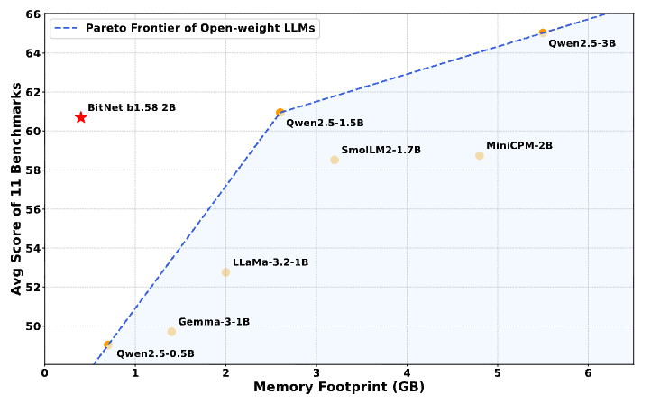
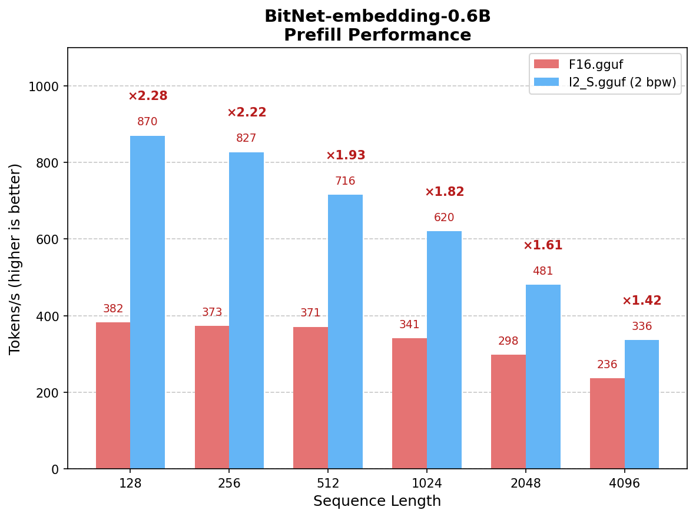
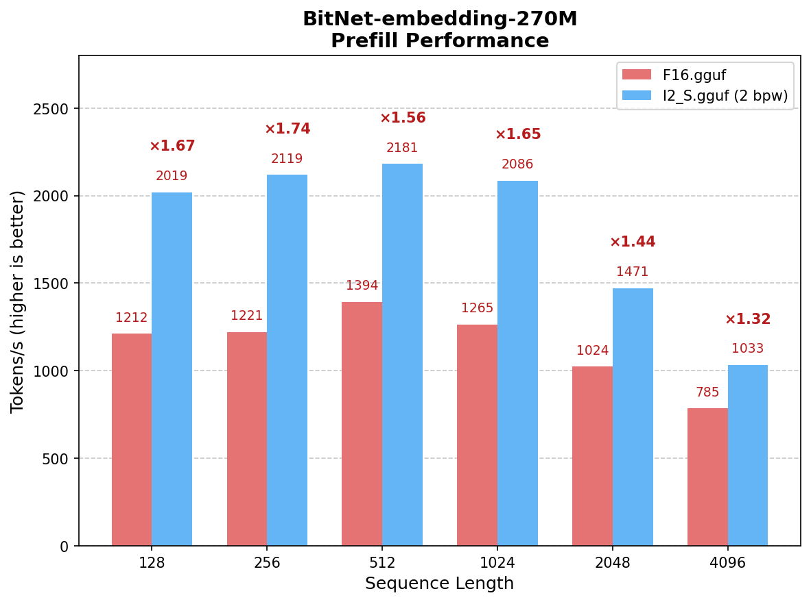

<div align="center">

# bitnet.cpp

[](https://opensource.org/licenses/MIT)

[](https://huggingface.co/collections/microsoft/bitnet)
[](https://arxiv.org/abs/2502.11880)
[](https://demo-bitnet-h0h8hcfqeqhrf5gf.canadacentral-01.azurewebsites.net/)
[](https://github.com/microsoft/BitNet/blob/main/gpu/README.md)

</div>

<div align="left">

<h3>📰 News</h3>

<strong>07/20/2026:</strong> 📣 We released <a href="https://huggingface.co/microsoft/BitNet-embedding-0.6B"><strong>BitNet-embedding-0.6B</strong></a> and <a href="https://huggingface.co/microsoft/BitNet-embedding-270M"><strong>BitNet-embedding-270M</strong></a> on Hugging Face — the first 1-bit embedding models that deliver competitive embedding quality with significantly faster inference on CPUs. 
- **1.42x to 2.28x speedup** over F16 on BitNet-embedding-0.6B prefill (8 threads)
- **1.32x to 1.74x speedup** over F16 on BitNet-embedding-270M prefill (8 threads)
- Supports I2_S conversion with optimized kernels on x86 CPUs
- Lossless inference with 2 bits per weight

07/16/2026: 📣 Released [BitNet Embeddings 0.6B/270M: I2_S Conversion and Inference Optimization](docs/bitnet-embeddings-i2s-guide.md) — detailed guide for converting and running BitNet embedding models with optimized I2_S kernels.

01/15/2026: 📣 Released [BitNet CPU Inference Optimization](https://github.com/microsoft/BitNet/blob/main/src/README.md) — parallel kernel implementations with configurable tiling and embedding quantization support, achieving **1.15x to 2.1x** additional speedup over the original implementation.

05/20/2025: 📣 Released [BitNet Official GPU inference kernel](https://github.com/microsoft/BitNet/blob/main/gpu/README.md) — extending 1-bit inference beyond CPUs.

04/14/2025: 📣 Released [BitNet Official 2B Parameter Model](https://huggingface.co/microsoft/BitNet-b1.58-2B-4T) on Hugging Face — the first official BitNet b1.58 model trained with 4T tokens.

02/18/2025: 📑 [Bitnet.cpp: Efficient Edge Inference for Ternary LLMs](https://arxiv.org/abs/2502.11880) — system-level paper on bitnet.cpp's architecture and design.

11/08/2024: 📑 [BitNet a4.8: 4-bit Activations for 1-bit LLMs](https://arxiv.org/abs/2411.04965) — enabling 4-bit activations for further efficiency gains.

10/21/2024: 📑 [1-bit AI Infra: Part 1.1, Fast and Lossless BitNet b1.58 Inference on CPUs](https://arxiv.org/abs/2410.16144) — the technical report behind bitnet.cpp.

10/17/2024: 📣 bitnet.cpp 1.0 released.

03/21/2024: 📑 [The-Era-of-1-bit-LLMs: Training Tips, Code, FAQ](https://github.com/microsoft/unilm/blob/master/bitnet/The-Era-of-1-bit-LLMs__Training_Tips_Code_FAQ.pdf)

02/27/2024: 📑 [The Era of 1-bit LLMs: All Large Language Models are in 1.58 Bits](https://arxiv.org/abs/2402.17764) — the foundational paper introducing BitNet b1.58.

10/17/2023: 📑 [BitNet: Scaling 1-bit Transformers for Large Language Models](https://arxiv.org/abs/2310.11453) — the original BitNet paper.

</div>

## Overview

bitnet.cpp is the official inference framework for 1-bit LLMs (e.g., BitNet b1.58). It offers a suite of optimized kernels that support **fast** and **lossless** inference of 1.58-bit models on **CPU** and **GPU** (NPU support coming next).

Try it out via this [online demo](https://demo-bitnet-h0h8hcfqeqhrf5gf.canadacentral-01.azurewebsites.net/), or build and run it on your own [CPU](https://github.com/microsoft/BitNet?tab=readme-ov-file#build-from-source) or [GPU](https://github.com/microsoft/BitNet/blob/main/gpu/README.md).

bitnet.cpp achieves speedups of **1.37x** to **5.07x** on ARM CPUs, with larger models experiencing greater performance gains. Additionally, it reduces energy consumption by **55.4%** to **70.0%**, further boosting overall efficiency. On x86 CPUs, speedups range from **2.37x** to **6.17x** with energy reductions between **71.9%** to **82.2%**. Furthermore, bitnet.cpp can run a 100B BitNet b1.58 model on a single CPU, achieving speeds comparable to human reading (5-7 tokens per second), significantly enhancing the potential for running LLMs on local devices. Please refer to the [technical report](https://arxiv.org/abs/2410.16144) for more details.


## Model Releases

### 1. [BitNet-b1.58-2B-4T](https://huggingface.co/microsoft/BitNet-b1.58-2B-4T) - 1-bit Large Language Model

**BitNet-b1.58-2B-4T** is the first official BitNet b1.58 model with **2.4B parameters**, trained on **4 trillion tokens**. It is a ternary (1.58-bit) language model that delivers competitive performance with full-precision models of similar size while enabling significantly faster and more energy-efficient inference.

- **Fast CPU Inference**: Achieves up to **6.17x speedup** on x86 CPUs and **5.07x** on ARM CPUs compared to full-precision models.
- **Energy Efficient**: Reduces energy consumption by up to **82.2%** on x86 and **70.0%** on ARM.
- **GPU Support**: Official GPU inference kernel available for accelerated deployment.
- **Chat-Ready**: Supports conversational mode for interactive use.

[🤗 Hugging Face](https://huggingface.co/microsoft/BitNet-b1.58-2B-4T) | [🔗 Online Demo](https://demo-bitnet-h0h8hcfqeqhrf5gf.canadacentral-01.azurewebsites.net/) | [📄 Technical Report](https://arxiv.org/abs/2410.16144)



### 2. [BitNet-embedding-0.6B](https://huggingface.co/microsoft/BitNet-embedding-0.6B) - 1-bit Embedding Model

**BitNet-embedding-0.6B** is a **0.6B-parameter** 1-bit embedding model that achieves competitive embedding quality with significantly faster CPU inference. It is the first model to demonstrate that ternary weights can deliver strong performance on embedding tasks.

- **1.42x to 2.28x speedup** over F16 on prefill (8 threads, x86)
- **Lossless Quality**: Competitive embedding quality with 2 bits per weight
- **I2_S Kernel**: Supports optimized I2_S conversion on x86 CPUs

[🤗 Hugging Face](https://huggingface.co/microsoft/BitNet-embedding-0.6B) | [📄 I2_S Guide](docs/bitnet-embeddings-i2s-guide.md)



### 3. [BitNet-embedding-270M](https://huggingface.co/microsoft/BitNet-embedding-270M) - Lightweight 1-bit Embedding Model

**BitNet-embedding-270M** is a compact **270M-parameter** 1-bit embedding model designed for resource-constrained environments, offering fast inference with minimal memory footprint.

- **1.32x to 1.74x speedup** over F16 on prefill (8 threads, x86)
- **Lossless Quality**: Competitive embedding quality with 2 bits per weight
- **Lightweight**: Only 270M parameters for edge deployment scenarios

[🤗 Hugging Face](https://huggingface.co/microsoft/BitNet-embedding-270M) | [📄 I2_S Guide](docs/bitnet-embeddings-i2s-guide.md)




## Supported Models

<table>
    <tr>
        <th rowspan="2">Model</th>
        <th rowspan="2">Parameters</th>
        <th rowspan="2">CPU</th>
        <th colspan="3">Kernel</th>
    </tr>
    <tr>
        <th>I2_S</th>
        <th>TL1</th>
        <th>TL2</th>
    </tr>
    <tr>
        <th colspan="6" style="text-align:left;">Official Models</th>
    </tr>
    <tr>
        <td rowspan="2"><a href="https://huggingface.co/microsoft/BitNet-b1.58-2B-4T">BitNet-b1.58-2B-4T</a></td>
        <td rowspan="2">2.4B</td>
        <td>x86</td>
        <td>&#9989;</td>
        <td>&#10060;</td>
        <td>&#9989;</td>
    </tr>
    <tr>
        <td>ARM</td>
        <td>&#9989;</td>
        <td>&#9989;</td>
        <td>&#10060;</td>
    </tr>
    <tr>
        <td rowspan="2"><a href="https://huggingface.co/microsoft/BitNet-embedding-0.6B">BitNet-embedding-0.6B</a></td>
        <td rowspan="2">0.6B</td>
        <td>x86</td>
        <td>&#9989;</td>
        <td>&#10060;</td>
        <td>&#10060;</td>
    </tr>
    <tr>
        <td>ARM</td>
        <td>&#10060;</td>
        <td>&#10060;</td>
        <td>&#10060;</td>
    </tr>
    <tr>
        <td rowspan="2"><a href="https://huggingface.co/microsoft/BitNet-embedding-270M">BitNet-embedding-270M</a></td>
        <td rowspan="2">270M</td>
        <td>x86</td>
        <td>&#9989;</td>
        <td>&#10060;</td>
        <td>&#10060;</td>
    </tr>
    <tr>
        <td>ARM</td>
        <td>&#10060;</td>
        <td>&#10060;</td>
        <td>&#10060;</td>
    </tr>
    <tr>
        <th colspan="6" style="text-align:left;">Community Models</th>
    </tr>
    <tr>
        <td rowspan="2"><a href="https://huggingface.co/1bitLLM/bitnet_b1_58-large">bitnet_b1_58-large</a></td>
        <td rowspan="2">0.7B</td>
        <td>x86</td>
        <td>&#9989;</td>
        <td>&#10060;</td>
        <td>&#9989;</td>
    </tr>
    <tr>
        <td>ARM</td>
        <td>&#9989;</td>
        <td>&#9989;</td>
        <td>&#10060;</td>
    </tr>
    <tr>
        <td rowspan="2"><a href="https://huggingface.co/1bitLLM/bitnet_b1_58-3B">bitnet_b1_58-3B</a></td>
        <td rowspan="2">3.3B</td>
        <td>x86</td>
        <td>&#10060;</td>
        <td>&#10060;</td>
        <td>&#9989;</td>
    </tr>
    <tr>
        <td>ARM</td>
        <td>&#10060;</td>
        <td>&#9989;</td>
        <td>&#10060;</td>
    </tr>
    <tr>
        <td rowspan="2"><a href="https://huggingface.co/HF1BitLLM/Llama3-8B-1.58-100B-tokens">Llama3-8B-1.58-100B-tokens</a></td>
        <td rowspan="2">8.0B</td>
        <td>x86</td>
        <td>&#9989;</td>
        <td>&#10060;</td>
        <td>&#9989;</td>
    </tr>
    <tr>
        <td>ARM</td>
        <td>&#9989;</td>
        <td>&#9989;</td>
        <td>&#10060;</td>
    </tr>
    <tr>
        <td rowspan="2"><a href="https://huggingface.co/collections/tiiuae/falcon3-67605ae03578be86e4e87026">Falcon3 Family</a></td>
        <td rowspan="2">1B-10B</td>
        <td>x86</td>
        <td>&#9989;</td>
        <td>&#10060;</td>
        <td>&#9989;</td>
    </tr>
    <tr>
        <td>ARM</td>
        <td>&#9989;</td>
        <td>&#9989;</td>
        <td>&#10060;</td>
    </tr>
    <tr>
        <td rowspan="2"><a href="https://huggingface.co/collections/tiiuae/falcon-edge-series-6804fd13344d6d8a8fa71130">Falcon-E Family</a></td>
        <td rowspan="2">1B-3B</td>
        <td>x86</td>
        <td>&#9989;</td>
        <td>&#10060;</td>
        <td>&#9989;</td>
    </tr>
    <tr>
        <td>ARM</td>
        <td>&#9989;</td>
        <td>&#9989;</td>
        <td>&#10060;</td>
    </tr>
</table>

❗️**We use existing 1-bit LLMs available on [Hugging Face](https://huggingface.co/) to demonstrate the inference capabilities of bitnet.cpp. We hope the release of bitnet.cpp will inspire the development of 1-bit LLMs in large-scale settings in terms of model size and training tokens.**

## Installation

### Requirements
- python>=3.10
- cmake>=3.22
- clang>=18
    - For Windows users, install [Visual Studio 2022](https://visualstudio.microsoft.com/downloads/). In the installer, toggle on at least the following options(this also automatically installs the required additional tools like CMake):
        -  Desktop-development with C++
        -  C++-CMake Tools for Windows
        -  Git for Windows
        -  C++-Clang Compiler for Windows
        -  MS-Build Support for LLVM-Toolset (clang)
    - For Debian/Ubuntu users, you can download with [Automatic installation script](https://apt.llvm.org/)

        `bash -c "$(wget -O - https://apt.llvm.org/llvm.sh)"`
- conda (highly recommend)

### Build from source

> [!IMPORTANT]
> If you are using Windows, please remember to always use a Developer Command Prompt / PowerShell for VS2022 for the following commands. Please refer to the FAQs below if you see any issues.

1. Clone the repo
```bash
git clone --recursive https://github.com/microsoft/BitNet.git
cd BitNet
```
2. Install the dependencies
```bash
# (Recommended) Create a new conda environment
conda create -n bitnet-cpp python=3.10
conda activate bitnet-cpp

pip install -r requirements.txt
```
3. Build the project
```bash
# Manually download the model and run with local path
huggingface-cli download microsoft/BitNet-b1.58-2B-4T-gguf --local-dir models/BitNet-b1.58-2B-4T
python setup_env.py -md models/BitNet-b1.58-2B-4T -q i2_s

```
<pre>
usage: setup_env.py [-h] [--hf-repo {1bitLLM/bitnet_b1_58-large,1bitLLM/bitnet_b1_58-3B,HF1BitLLM/Llama3-8B-1.58-100B-tokens,tiiuae/Falcon3-1B-Instruct-1.58bit,tiiuae/Falcon3-3B-Instruct-1.58bit,tiiuae/Falcon3-7B-Instruct-1.58bit,tiiuae/Falcon3-10B-Instruct-1.58bit}] [--model-dir MODEL_DIR] [--log-dir LOG_DIR] [--quant-type {i2_s,tl1}] [--quant-embd]
                    [--use-pretuned]

Setup the environment for running inference

optional arguments:
  -h, --help            show this help message and exit
  --hf-repo {1bitLLM/bitnet_b1_58-large,1bitLLM/bitnet_b1_58-3B,HF1BitLLM/Llama3-8B-1.58-100B-tokens,tiiuae/Falcon3-1B-Instruct-1.58bit,tiiuae/Falcon3-3B-Instruct-1.58bit,tiiuae/Falcon3-7B-Instruct-1.58bit,tiiuae/Falcon3-10B-Instruct-1.58bit}, -hr {1bitLLM/bitnet_b1_58-large,1bitLLM/bitnet_b1_58-3B,HF1BitLLM/Llama3-8B-1.58-100B-tokens,tiiuae/Falcon3-1B-Instruct-1.58bit,tiiuae/Falcon3-3B-Instruct-1.58bit,tiiuae/Falcon3-7B-Instruct-1.58bit,tiiuae/Falcon3-10B-Instruct-1.58bit}
                        Model used for inference
  --model-dir MODEL_DIR, -md MODEL_DIR
                        Directory to save/load the model
  --log-dir LOG_DIR, -ld LOG_DIR
                        Directory to save the logging info
  --quant-type {i2_s,tl1}, -q {i2_s,tl1}
                        Quantization type
  --quant-embd          Quantize the embeddings to f16
  --use-pretuned, -p    Use the pretuned kernel parameters
</pre>

## Usage
### Basic usage
```bash
# Run inference with the quantized model
python run_inference.py -m models/BitNet-b1.58-2B-4T/ggml-model-i2_s.gguf -p "You are a helpful assistant" -cnv
```
<pre>
usage: run_inference.py [-h] [-m MODEL] [-n N_PREDICT] -p PROMPT [-t THREADS] [-c CTX_SIZE] [-temp TEMPERATURE] [-cnv]

Run inference

optional arguments:
  -h, --help            show this help message and exit
  -m MODEL, --model MODEL
                        Path to model file
  -n N_PREDICT, --n-predict N_PREDICT
                        Number of tokens to predict when generating text
  -p PROMPT, --prompt PROMPT
                        Prompt to generate text from
  -t THREADS, --threads THREADS
                        Number of threads to use
  -c CTX_SIZE, --ctx-size CTX_SIZE
                        Size of the prompt context
  -temp TEMPERATURE, --temperature TEMPERATURE
                        Temperature, a hyperparameter that controls the randomness of the generated text
  -cnv, --conversation  Whether to enable chat mode or not (for instruct models.)
                        (When this option is turned on, the prompt specified by -p will be used as the system prompt.)
</pre>

### Demo

A demo of bitnet.cpp running a BitNet b1.58 3B model on Apple M2:

https://github.com/user-attachments/assets/7f46b736-edec-4828-b809-4be780a3e5b1

### Benchmark
We provide scripts to run the inference benchmark providing a model.

```  
usage: e2e_benchmark.py -m MODEL [-n N_TOKEN] [-p N_PROMPT] [-t THREADS]  
   
Setup the environment for running the inference  
   
required arguments:  
  -m MODEL, --model MODEL  
                        Path to the model file. 
   
optional arguments:  
  -h, --help  
                        Show this help message and exit. 
  -n N_TOKEN, --n-token N_TOKEN  
                        Number of generated tokens. 
  -p N_PROMPT, --n-prompt N_PROMPT  
                        Prompt to generate text from. 
  -t THREADS, --threads THREADS  
                        Number of threads to use. 
```  
   
Here's a brief explanation of each argument:  
   
- `-m`, `--model`: The path to the model file. This is a required argument that must be provided when running the script.  
- `-n`, `--n-token`: The number of tokens to generate during the inference. It is an optional argument with a default value of 128.  
- `-p`, `--n-prompt`: The number of prompt tokens to use for generating text. This is an optional argument with a default value of 512.  
- `-t`, `--threads`: The number of threads to use for running the inference. It is an optional argument with a default value of 2.  
- `-h`, `--help`: Show the help message and exit. Use this argument to display usage information.  
   
For example:  
   
```sh  
python utils/e2e_benchmark.py -m /path/to/model -n 200 -p 256 -t 4  
```  
   
This command would run the inference benchmark using the model located at `/path/to/model`, generating 200 tokens from a 256 token prompt, utilizing 4 threads.  

For the model layout that do not supported by any public model, we provide scripts to generate a dummy model with the given model layout, and run the benchmark on your machine:

```bash
python utils/generate-dummy-bitnet-model.py models/bitnet_b1_58-large --outfile models/dummy-bitnet-125m.tl1.gguf --outtype tl1 --model-size 125M

# Run benchmark with the generated model, use -m to specify the model path, -p to specify the prompt processed, -n to specify the number of token to generate
python utils/e2e_benchmark.py -m models/dummy-bitnet-125m.tl1.gguf -p 512 -n 128
```

### Convert from `.safetensors` Checkpoints

```sh
# Prepare the .safetensors model file
huggingface-cli download microsoft/bitnet-b1.58-2B-4T-bf16 --local-dir ./models/bitnet-b1.58-2B-4T-bf16

# Convert to gguf model
python ./utils/convert-helper-bitnet.py ./models/bitnet-b1.58-2B-4T-bf16
```

## Acknowledgements

This project is based on the [llama.cpp](https://github.com/ggerganov/llama.cpp) framework. We would like to thank all the authors for their contributions to the open-source community. Also, bitnet.cpp's kernels are built on top of the Lookup Table methodologies pioneered in [T-MAC](https://github.com/microsoft/T-MAC/). For inference of general low-bit LLMs beyond ternary models, we recommend using T-MAC.

### FAQ (Frequently Asked Questions)📌 

#### Q1: The build dies with errors building llama.cpp due to issues with std::chrono in log.cpp?

**A:**
This is an issue introduced in recent version of llama.cpp. Please refer to this [commit](https://github.com/tinglou/llama.cpp/commit/4e3db1e3d78cc1bcd22bcb3af54bd2a4628dd323) in the [discussion](https://github.com/abetlen/llama-cpp-python/issues/1942) to fix this issue.

#### Q2: How to build with clang in conda environment on windows?

**A:** 
Before building the project, verify your clang installation and access to Visual Studio tools by running:
```
clang -v
```

This command checks that you are using the correct version of clang and that the Visual Studio tools are available. If you see an error message such as:
```
'clang' is not recognized as an internal or external command, operable program or batch file.
```

It indicates that your command line window is not properly initialized for Visual Studio tools.

• If you are using Command Prompt, run:
```
"C:\Program Files\Microsoft Visual Studio\2022\Professional\Common7\Tools\VsDevCmd.bat" -startdir=none -arch=x64 -host_arch=x64
```

• If you are using Windows PowerShell, run the following commands:
```
Import-Module "C:\Program Files\Microsoft Visual Studio\2022\Professional\Common7\Tools\Microsoft.VisualStudio.DevShell.dll" Enter-VsDevShell 3f0e31ad -SkipAutomaticLocation -DevCmdArguments "-arch=x64 -host_arch=x64"
```

These steps will initialize your environment and allow you to use the correct Visual Studio tools.
