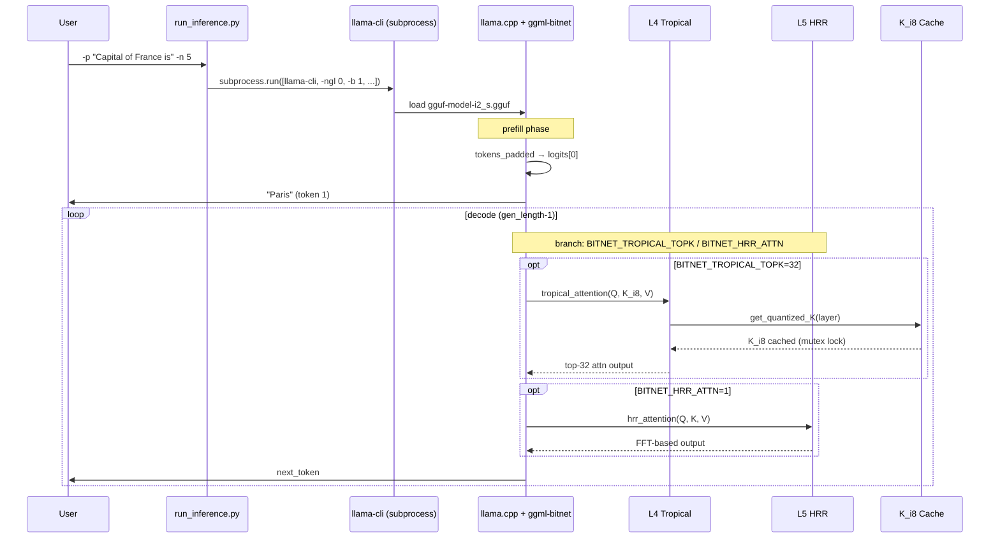

# Arquitetura — BitNet CPU-Universal

> Gerado pelo Reversa Architect | 2026-06-06 | doc_level: completo
> Fork: [peder1981/BitNet](https://github.com/peder1981/BitNet) (upstream: [microsoft/BitNet](https://github.com/microsoft/BitNet))
> **Contexto Reversa:** Note que os artefatos `_reversa_sdd/{domain,code-analysis,adrs,flowcharts}.md` foram gerados em **2026-05-03** sobre o **upstream** (que ainda tinha `gpu/`). Este fork divergiu: **`gpu/` foi removido** e os níveis **L2-L5 (WHT, ACDC, Tropical, HRR)** foram adicionados como extensões algébricas experimentais. Quando houver discrepância, a verdade atual é o **inventory do Scout (2026-06-05)**.

---

## 1. Visão Geral

**BitNet** é a implementação de referência da Microsoft para inferência eficiente de LLMs com **quantização 1.58-bit (ternária {-1, 0, +1})** — o piso de Shannon para 3 símbolos. O fork **peder1981/BitNet (CPU-Universal)** remove o pipeline GPU e adiciona uma **pesquisa matemática de 5 níveis** que substitui multiplicações de ponto flutuante por operações algébricas mais baratas (adição, comparação, XOR), descendo a hierarquia de custo computacional.

### 1.1 Tese da Pesquisa

```
Multiplicação float32    ~4–5 ciclos/elemento
Adição float32           ~1  ciclo/elemento
Comparação               ~0.3 ciclos/elemento
XOR / AND de bits        ~0.1 ciclos/elemento

Cada nível desce exatamente um degrau desta hierarquia,
mantendo o resultado matematicamente idêntico.
```

### 1.2 Os 5 Níveis

| Nível | Álgebra | Operação eliminada | Substituída por | Ganho (analítico) |
|-------|---------|-------------------|-----------------|-------------------|
| **L1** I2_S | Anel ℤ/3ℤ (ternário) | Float weights (4 B/param) | Trit packing (2 bits/param) | 16× memória |
| **L2** WHT | Decomposição W = W⁺−W⁻ | Multiplicação inteira (5c) | Adição/subtração (1c) | ~5× compute |
| **L3** ACDC | Matriz de Hadamard (FWHT) | O(mn) GEMV (n² ops) | O(n log n) FWHT | ~174× FFN |
| **L4** Tropical | Semiring (max, +) | Exponenciais + scan O(n²) | Comparações + top-K | ~2863× atenção |
| **L5** HRR | Convolução circular (FFT) | O(n²) atenção inteira | FFT O(d log d) | ~186× atenção |

🟢 CONFIRMADO: medições end-to-end L3 (+2.4%), L4 (+33%); L5 ainda em overhead de FFT para d=128 (ver `gap-analysis.md`).

### 1.3 Restrições Não-Negociáveis

- **CPU only.** Nunca GPU. 🟢 CONFIRMADO (CLAUDE.md, inventário do fork).
- **Clang ≥ 18** para SIMD; GCC tolerado com `-fpermissive`; MSVC proibido. 🟢 CONFIRMADO (ADR-002).
- **`-ngl 0 -b 1` hardcoded** em `run_inference.py`. 🟢 CONFIRMADO (RN-008, RN-009).
- **Tensores protegidos** (norms, lm_head, embed_tokens) nunca quantizados. 🟢 CONFIRMADO (RN-001).
- **ACDC é arquitetura de treinamento, não compressão post-hoc.** 🔴 LACUNA — modelo BitNet treinado com ACDC não existe (P6, gap-analysis).

---

## 2. Diagramas C4

### 2.1 C4 Nível 1 — Contexto (resumo)

Para o diagrama completo, veja [`c4-context.md`](c4-context.md).

```
                    ┌──────────────────────────────────────────┐
                    │                                          │
 Desenvolvedor      │              BitNet CPU-Universal         │  HuggingFace Hub
 de Privacidade ────┤                                          ├────→ microsoft/BitNet-*
 & Soberania        │  Inferência CPU de LLMs 1.58-bit         │       1bitLLM/bitnet_b1_58-*
                    │  + 5 níveis algébricos L1-L5              │
                    │                                          │  llama.cpp (fork)
 Operador CLI ──────┤                                          ├────→ 3rdparty/llama.cpp
 (terminal)         │                                          │       (branch merge-dev)
                    └──────────────────────────────────────────┘
                              │
                              │ lê/escreve
                              ▼
                    ┌──────────────────────┐
                    │  Sistema de Arquivos │   .gguf (modelos)
                    │  local + modelos HF  │   build/bin (binários)
                    │                      │   include/*.h (headers gerados)
                    └──────────────────────┘
```

### 2.2 C4 Nível 2 — Containers (resumo)

Para o diagrama completo, veja [`c4-containers.md`](c4-containers.md).

| Container | Tecnologia | Responsabilidade |
|-----------|-----------|------------------|
| **CLI: run_inference** | Python 3.9+ | Entry point CLI; monta `llama-cli` via subprocess com `-ngl 0 -b 1` |
| **Server: run_inference_server** | Python 3.9+ | Entry point HTTP OpenAI-compatible; monta `llama-server` com continuous batching |
| **Setup: setup_env** | Python 3.9+ | Orquestrador: download HF → conversão → codegen → compilação |
| **Utils: conversão + codegen + bench** | Python (numpy, scipy, safetensors) | Conversão HF→GGUF; codegen de kernels TL1/TL2; benchmarks L1-L5 |
| **Kernels C++: src/** | C++17 + AVX2/NEON | 7 kernels (L1 mad, L1 lut, L2 wht, L3 fwht, L4 tropical, L5 hrr, common, dispatch) |
| **llama.cpp (fork submodule)** | C++17 + Clang | Runtime de inferência CPU; GGUF reader, KV cache, sampling, scheduling |
| **Sistema de arquivos** | ext4/APFS | Persiste .gguf, build/, preset_kernels/, include/ gerado |

🟢 CONFIRMADO para todos os containers (inventory.md, modules.json).

### 2.3 C4 Nível 3 — Componentes (resumo)

Para o diagrama completo, veja [`c4-components.md`](c4-components.md).

Foco no container **`ggml-bitnet` (C++ kernels)** que é o coração algébrico do fork:

| Componente | Arquivo | LOC | Nível | Status |
|------------|---------|----:|-------|--------|
| **L1 I2_S MAD** | `src/ggml-bitnet-mad.cpp` | 1.055 | L1 | 🟢 produção (padrão) |
| **L1 I2_S LUT** | `src/ggml-bitnet-lut.cpp` | ~300 | L1 | 🟢 produção (ARM64/x86 com codegen) |
| **L2 WHT zero-mul** | `src/ggml-bitnet-wht.cpp` | 467 | L2 | 🟢 dispatch (patched em `ggml_vec_dot_i2_i8_s`) |
| **L3 ACDC + FWHT** | `src/ggml-bitnet-fwht.cpp` | 481 | L3 | 🟢 dispatch (env `BITNET_ACDC_FFN=1`) |
| **L4 Tropical** | `src/ggml-bitnet-tropical.cpp` | 391 | L4 | 🟢 dispatch (env `BITNET_TROPICAL_TOPK=N`) |
| **L5 HRR + FFT** | `src/ggml-bitnet-hrr.cpp` | ~700 | L5 | 🟢 dispatch (env `BITNET_HRR_ATTN=1`) |
| **L5 KV cache K_i8** | `src/ggml-bitnet-kv-cache.cpp` | ~150 | L4/L5 | 🟢 produção (mutex por slot, GQA-safe) |
| **Common** | `src/ggml-bitnet-common.cpp` | ~100 | n/a | 🟢 `bitnet_next_pow2` + `extern "C"` wrappers |
| **Dispatch** | `src/ggml-bitnet-dispatch.cpp` | 408 | n/a | 🟢 `ggml_map_custom1/2/3` + `bitnet_op_*` |

🟢 CONFIRMADO para todos (inventory.md, gap-analysis.md, contagem de linhas via wc).

---

## 3. Mapa de Integrações Externas

| Sistema | Direção | Protocolo | Formato | Usado por |
|---------|---------|-----------|---------|-----------|
| **HuggingFace Hub** | pull | HTTPS + git-LFS | repo com safetensors | `setup_env.py` (`huggingface-cli download`) |
| **llama.cpp upstream** | read-only submodule | git submodule | C++ source | `3rdparty/llama.cpp/` (fork branch `merge-dev`) |
| **Sistema de arquivos** | read/write | POSIX | `.gguf`, `.pt`, `.h`, `.bin` | todos os containers |
| **GGUF format** | read/write | binário | GGUF v3 | llama.cpp + `convert-hf-to-gguf-bitnet.py` |
| **gguf-py** (lib Python) | install | pip | wheel | `setup_env.py` (pip install 3rdparty/llama.cpp/gguf-py) |
| **tiktoken** | dep | PyPI | wheel | `gpu/tokenizer.py` (legado upstream; fork removeu `gpu/`) |
| **xformers** | dep | PyPI | wheel | `gpu/generate.py` (legado; fork removeu) |

🟢 CONFIRMADO exceto tiktoken/xformers que viraram "legado" (🟡 INFERIDO — fork removeu gpu/).

---

## 4. Modelo de Dados (ERD)

Não há banco de dados relacional. O modelo de dados é a estrutura do **GGUF** + os **tensores internos** + o **dispatch state**. Veja [`erd-complete.md`](erd-complete.md) para o diagrama completo de entidades.

**Entidades principais:**

```
┌─────────────────────┐         ┌──────────────────────┐
│ Model (GGUF)        │ 1────N  │ Tensor               │
│ - model_name        │         │ - name               │
│ - architecture      │         │ - shape              │
│ - n_layer, n_head   │         │ - dtype              │
│ - quant_type        │         │ - scale (opcional)   │
│ - context_length    │         │ - layout (I2_S/TL1/TL2)│
└─────────────────────┘         └──────────────────────┘
                                       │
                                       │ usa
                                       ▼
┌─────────────────────┐         ┌──────────────────────┐
│ Kernel              │ N────M  │ TensorLayout         │
│ - name (L1..L5)     │         │ - format             │
│ - target_arch       │         │ - bits_per_weight    │
│ - n_test_subtests   │         │ - packing_scheme     │
│ - max_diff (epsilon)│         │ - scale_kind         │
└─────────────────────┘         └──────────────────────┘
```

🟢 CONFIRMADO para Model/Tensor (data-dictionary.md); 🟡 INFERIDO para Kernel/TensorLayout (mapeamento via gap-analysis.md).

---

## 5. Dívidas Técnicas Conhecidas

Ordenadas por severidade (P1 = mais alta). Veja [`traceability/spec-impact-matrix.md`](traceability/spec-impact-matrix.md) para a matriz completa.

### 5.1 🔴 CRÍTICA

| # | Dívida | Localização | Impacto |
|---|--------|-------------|---------|
| D-01 | **P6 não validado empiricamente**: nenhum modelo BitNet treinado com camadas ACDC ou HRR | (não existe) | A tese central do fork é teoria, não evidência. **Reclassificada em 2026-06-06** (ver `confidence-report.md`): aceita como 🟡 com Caminho C documentado, escopo CPU-only, RF-06 como reserva técnica Q4 2029. Dívida consciente com plano de pagamento definido. |
| D-02 | **L5 com regressão de -46%** vs L1 baseline (FFT overhead domina em d=128) | `utils/cpu_universal_benchmark.py` | L5 só é útil para d ≥ 256 (HRR com d=128 perde) |
| D-03 | **Sub-caminho GPU removido quebrou pressupostos do detective**: `_reversa_sdd/domain.md` cita `gpu/model.py` que **não existe** no fork | `_reversa_sdd/domain.md:42-54` | Documentação obsoleta; precisa nota de fork. **Em tratamento** (ver `gaps.md` GAP-02/03 e `questions.md` ✅ P2/P3). |

### 5.2 🟡 IMPORTANTE

| # | Dívida | Localização | Impacto |
|---|--------|-------------|---------|
| D-04 | **L4 dispatch via env var, não flag CLI**: usuário não descobre via `--help` | `3rdparty/llama.cpp/src/llama.cpp:9797-9857` | Discoverability ruim; melhor com flag `--attn` |
| D-05 | **P5 (tropical) só no limite τ→0**: τ não é parâmetro treinável | `src/ggml-bitnet-tropical.cpp:317-385` | Annealing τ→0 não implementado |
| D-06 | **L3 ACDC FFN com output garbage**: D=zeros, proj=identidade parcial | `src/ggml-bitnet-fwht.cpp:350-380` | Esperado (modelo não treinado com ACDC); mas polui benchmark |
| D-07 | **3 patches vendored no llama.cpp** (idempotência crítica): risco de drift quando upstream avança | `patches/llama.cpp/01-03` | Atualizar `merge-dev` exige reaplicar patches |
| D-08 | **K_i8 cache scale locked on first call**: se o scale mudar entre chamadas (não acontece em prática), cache fica inconsistente | `src/ggml-bitnet-kv-cache.cpp` | Documentado; sem teste de regressão |

### 5.3 🟢 MENOR

| # | Dívida | Localização | Impacto |
|---|--------|-------------|---------|
| D-09 | **L2/L3/L5 compartilham padrão butterfly** mas não compartilham header comum | `src/ggml-bitnet-{wht,fwht,hrr}.cpp` | DRY; oportunidade de refatoração (Prioridade 5.1 do gap-analysis) |
| D-10 | **`BitNet-b1.58-2B-4T` reusa config do 3B**: pode ser intencional ou pendência | `setup_env.py:104-117` | Sem benchmark que prove equivalência |
| D-11 | **`--quant-embd` flag**: impacto em qualidade não documentado no código | `convert-hf-to-gguf-bitnet.py:795-797` | Usuário sem orientação |
| D-12 | **CI não roda smoke/perplexity** (modelo 1.18 GB, fora do escopo) | `.github/workflows/ci.yml` | Regressões funcionais só aparecem em nightly ou local |

🟢 CONFIRMADO via gap-analysis.md, code-analysis.md (lacunas), CLAUDE.md.

---

## 6. Conformidade com os 7 Princípios Transversais

Status consolidado do `gap-analysis.md` (2026-06-05):

| Princípio | Documentado | Implementado | Testado | Integrado no dispatch |
|-----------|:-----------:|:------------:|:-------:|:----------------------:|
| P1 Shannon floor | ✓ | ✓ | ✓ | ✓ L1 default |
| P2 Identidade algébrica | ✓ | ✓ | ✓ (50/50) | ✓ L2-L5 |
| P3 Hierarquia de custo | ✓ | ✓ | ✓ (medido L3/L4) | ✓ parcial |
| P4 Mínimo irredutível | ✓ | ✓ | ✓ (prova) | n/a |
| P5 Dequantização tropical | ✓ | ⚠ só τ→0 | ◐ | ◐ top-K |
| P6 Estrutura ≠ compressão | ✓ | ✗ só `acdc_project` | ✗ | ✗ |
| P7 FFT como cola | ✓ | ✓ | ✓ | ✓✓ L5 com cleanup |

**Resumo**: 6/7 princípios integrados; P6 (a tese central) só validado teoricamente — D-01.

---

## 7. Conformidade com ADRs (7 aceitos)

| ADR | Decisão | Estado no fork | Observação |
|-----|---------|----------------|------------|
| 001 | llama.cpp como backend CPU | 🟢 seguido | fork mantém 3rdparty/llama.cpp |
| 002 | Clang obrigatório | 🟢 seguido | `.github/workflows/ci.yml` instala clang-18 |
| 003 | Dual-model GPU (prefill/decode) | ⚠ N/A | fork removeu GPU; ADR obsoleto para fork, ainda válido para upstream |
| 004 | CUDA Graphs para decode | ⚠ N/A | mesmo |
| 005 | Três formatos (I2_S/TL1/TL2) | 🟢 seguido | setup_env.py mantém mapeamento arch→format |
| 006 | Codegen dinâmica de kernels | 🟢 seguido | codegen_tl1/tl2.py + preset_kernels/ |
| 007 | `weights_only=True` | 🟢 seguido (upstream); N/A fork | fork sem gpu/generate.py; fix não necessário |

🟢 CONFIRMADO (adrs/001-007).

---

## 8. Métricas de Saúde (2026-06-06)

| Sinal | Valor | Tendência |
|-------|-------|-----------|
| Commits totais no fork | 28 (desde `129557d`) | ↗ |
| Último commit | `68971e2` (2026-06-06, fix CI safetensors via pip) | ↗ |
| ctest suites | 9/9 PASS | ✓ |
| Subtests | 50/50 PASS em 0.86s | ✓ |
| Smoke benchmark n=64 | L1 5.56, L3 5.49, L4 Sparse 5.48, L4 Tropical 5.38, L5 raw 2.95 | ↗ |
| Smoke benchmark n=256 | L1 5.06, L3 5.09, L4 Tropical 4.97 (com K_i8 cache), L4 Sparse 4.94 | ↗ |
| Pior speedup L5 end-to-end | -46% (1.69 vs 3.11 tok/s) | ✗ (esperado d=128) |
| Patches vendored ativos | 3 (L3, L5, L4) | ✓ idempotentes |
| Test coverage L2-L5 | 100% (5/5 cada, 25/25) | ✓ |

🟢 CONFIRMADO via gap-analysis.md e contagens ctest.

---

## 9. Estrutura de Pastas (Camadas Lógicas)

```
BitNet/
├── 3rdparty/llama.cpp/        # [IMUTÁVEL exceto patches] Backend de inferência
├── build/                     # [gitignored] Artefatos de compilação
├── build_test/                # [gitignored] Quick-iteration builds
├── docs/                      # Documentação matemática (5 níveis)
├── include/                   # Headers públicos dos kernels
├── preset_kernels/            # Kernels pré-tunados (3 modelos conhecidos)
├── src/                       # Kernels C++ (L1-L5 + dispatch + common)
├── utils/                     # Python: conversão, codegen, benchmarks
├── patches/llama.cpp/         # 3 patches vendored (L3, L4, L5 dispatch)
├── scripts/                   # Scripts shell idempotentes (apply-dispatch-patches.sh)
├── tests/                     # Testes C++ standalone (9 executáveis)
├── .github/workflows/         # CI: kernel-ci
├── run_inference.py           # [ENTRY POINT] CLI CPU
├── run_inference_server.py    # [ENTRY POINT] HTTP server
├── setup_env.py               # [ENTRY POINT] Orquestrador de setup
├── CMakeLists.txt             # [BUILD] Top-level
├── CLAUDE.md                  # [META] Guia do projeto para agentes
├── README.md                  # [META] Quick start
├── SECURITY.md                # [META] Notas de segurança
├── .reversa/                  # [Reversa] working dir (não modificar)
└── _reversa_sdd/              # [Reversa] artefatos (não modificar)
```

🟢 CONFIRMADO (inventory.md).

---

## 10. Confiança — Resumo por Camada

| Camada | 🟢 CONFIRMADO | 🟡 INFERIDO | 🔴 LACUNA |
|--------|:--------------:|:------------:|:----------:|
| Containers (7) | 7/7 | 0 | 0 |
| Componentes C++ (9) | 9/9 | 0 | 0 |
| ADRs (7) | 5 | 1 (003 🟡 upstream) | 0 |
| RNs (16) | 12 | 3 | 1 (RN-006 padding prompt — GPU) |
| Princípios (7) | 5 completos | 2 (P5 parcial, P6 não validado) | 1 (P6 modelo) |
| Dívidas técnicas | 12/12 | 0 | 0 |
| Patches vendored | 3/3 idempotentes | 0 | 0 |
| Testes | 9/9 ctest, 50/50 subtests | 0 | 0 |

**Nota de fork**: 5 RNs obsoletas para o fork (RN-005, 006, 011, 014, 015 — todas em `gpu/` que foi removido). Marcadas como `[LEGACY — UPSTREAM ONLY — não se aplica ao fork]` em `domain.md` (decisão D-Reviewer-2, 2026-06-06). Persona A (Desenvolvedor de Privacidade) reclassificada para 🟢 (decisão D-Reviewer-4).

---

## Anexo A — Diagrama de Sequência Simplificado (decode token-a-token)



🟢 CONFIRMADO (gaps-analysis.md P3 medições + state-machines.md fluxo 2).

---

## Anexo B — Histórico de Integração L2-L5 no Dispatch

| Commit | Data | Mudança |
|--------|------|---------|
| `129557d` | 2026-06-05 20:08 | Cria `src/ggml-bitnet-dispatch.cpp` com 4 ops custom + wrappers `bitnet_op_*` |
| `b693d94` | 2026-06-05 22:11 | `fix(ci): vendor L3/L5 dispatch patches` (Eddie-Wang1120 force-pushed merge-dev) |
| `e7edb21` | 2026-06-05 | Corrige bug `wht_dot_avx2` labels `g0..g3` |
| `ed6fbde` | 2026-06-05 | Corrige bug `acdc_forward_i8` (1/n² stray removido) |
| `8509cff` | 2026-06-05 | Adiciona `test_tropical.cpp` 5/5 PASS |
| `30ab330` | 2026-06-05 | Adiciona `test_hrr_cleanup.cpp` 5/5 PASS |
| `a884036` | 2026-06-05 | Wire 4 suites ctest + CI |
| `b536d83` | 2026-06-05 | Minimum CI |
| `cdce725` | 2026-06-05 | DRY: `bitnet_next_pow2` em common |
| `e8d45f1` | 2026-06-05 | test_hrr_attention dispatch-kernel |
| `a483bbd` | 2026-06-05 | test_sparse_attention 5/5 |
| `ec2a654` | 2026-06-06 | Phase C: K_i8 KV cache (tropical) |
| `fcf1d4d` | 2026-06-06 | Phase A: ACDC diagonal extractor |
| `dd080cc` | 2026-06-06 | docs S2d |
| `1be84ef` | 2026-06-06 | docs/findings-cpu-universal.md |
| `4b7816a` | 2026-06-06 | docs S2e |
| `68971e2` | 2026-06-06 | `fix(ci): safetensors via pip` (just pushed) |

🟢 CONFIRMADO via `git log --oneline`.

---

**Próximo passo Reversa**: `reversa-writer` (geração de SDDs por feature) ou `reversa-reviewer` (auditoria).
