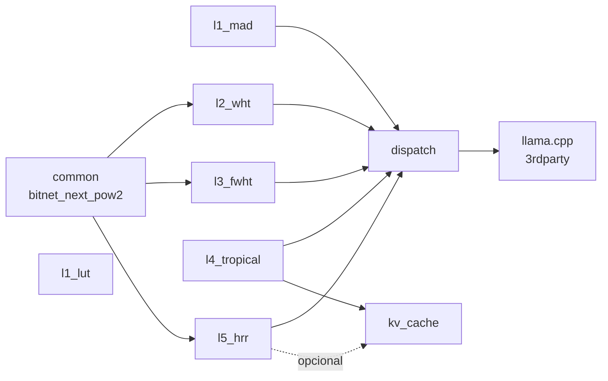

# C4 Nível 3 — Componentes (BitNet CPU-Universal)

> Gerado pelo Reversa Architect | 2026-06-06 | doc_level: completo
> Foco: container `kernels_cpp` (coração algébrico do fork). Diagramas em Mermaid.

---

## 1. Componentes do Container `kernels_cpp` (src/)

### 1.1 Diagrama Geral

```mermaid
C4Component
    title Componentes C++ — src/ggml-bitnet-*

    Component(common, "ggml-bitnet-common", "C++ header + impl", "bitnet_next_pow2 (extern 'C') + wrappers fwht_next_pow2 / hrr_next_pow2. Header compartilhado entre L2, L3, L5.")
    Component(l1_mad, "ggml-bitnet-mad (L1 I2_S MAD)", "C++ + AVX2/NEON SIMD", "Kernel SIMD principal I2_S. _mm256_maddubs_epi16 (x86). QK=128 (x86) / QK=64 (ARM).")
    Component(l1_lut, "ggml-bitnet-lut (L1 I2_S LUT)", "C++ + AVX2/NEON", "LUT kernel para TL1 (ARM) e TL2 (x86). Pool estático bitnet_tensor_extras[8192].")
    Component(l2_wht, "ggml-bitnet-wht (L2 WHT)", "C++ + AVX2", "Decomposição W=W⁺-W⁻; GEMV zero-mul via butterfly add/sub. Patchado em ggml_vec_dot_i2_i8_s.")
    Component(l3_fwht, "ggml-bitnet-fwht (L3 ACDC)", "C++ + AVX2", "FWHT in-place + diagonal d. acdc_forward_i8, acdc_project, acdc_gemv. Não-normalizado (sem 1/n²).")
    Component(l4_tropical, "ggml-bitnet-tropical (L4)", "C++", "tropical_attention (max,+) semiring. sparse_attention_float (opt-in). Acessa K_i8 cache.")
    Component(l5_hrr, "ggml-bitnet-hrr (L5)", "C++ + AVX2", "FFT Cooley-Tukey radix-2. hrr_bind/unbind/cleanup_iter (NAIVE+RESIDUAL Frady 2021).")
    Component(kv_cache, "ggml-bitnet-kv-cache (L4/L5)", "C++ + pthread", "K_i8 cache per (il, kv_h). Scale locked on first call. Mutex por slot (GQA-safe).")
    Component(dispatch, "ggml-bitnet-dispatch", "C++", "Wrappers bitnet_op_* via ggml_map_custom1/2/3. Captura layer via current_layer().")

    Rel(common, l2_wht, "extern 'C' fwht_next_pow2", "header")
    Rel(common, l3_fwht, "extern 'C' fwht_next_pow2", "header")
    Rel(common, l5_hrr, "extern 'C' hrr_next_pow2", "header")

    Rel(l1_mad, dispatch, "Operações GEMM base", "C++")
    Rel(l2_wht, dispatch, "bitnet_op_wht_dot (patched em vec_dot)", "C++")
    Rel(l3_fwht, dispatch, "bitnet_op_acdc_gemv (env BITNET_ACDC_FFN=1)", "C++")
    Rel(l4_tropical, dispatch, "bitnet_op_tropical_attn (env BITNET_TROPICAL_TOPK=N)", "C++")
    Rel(l4_tropical, kv_cache, "get/set quantized K", "C++")
    Rel(l5_hrr, dispatch, "bitnet_op_hrr_attn[_with_cleanup] (env BITNET_HRR_ATTN=1)", "C++")

    Rel(dispatch, llama_cpp, "Registrado em llm_build_kqv / llm_build_ffn", "C++ (3rdparty/llama.cpp patched)")
```

🟢 CONFIRMADO para todos os componentes e relações (gap-analysis.md P2/P7, inventory.md L1-L5).

---

## 2. Tabela de Componentes

| Componente | Arquivo | LOC | Nível | Função | Build flag |
|------------|---------|----:|-------|--------|-----------|
| **common** | `ggml-bitnet-common.{h,cpp}` | ~100 + ~50 | n/a | `bitnet_next_pow2` + extern "C" wrappers | always |
| **l1_mad** | `ggml-bitnet-mad.cpp` | 1.055 | L1 | GEMM SIMD I2_S (AVX2 `maddubs`, NEON) | always |
| **l1_lut** | `ggml-bitnet-lut.cpp` | ~300 | L1 | LUT kernel TL1 (ARM) / TL2 (x86) | `BITNET_ARM_TL1` / `BITNET_X86_TL2` |
| **l2_wht** | `ggml-bitnet-wht.cpp` | 467 | L2 | WHT zero-mul (AVX2 butterfly) | `BITNET_L2_WHT` |
| **l3_fwht** | `ggml-bitnet-fwht.cpp` | 481 | L3 | FWHT + ACDC (forward/project/gemv) | `BITNET_L3_ACDC` |
| **l4_tropical** | `ggml-bitnet-tropical.cpp` | 391 | L4 | Tropical attention (max,+) + sparse float | `BITNET_L4_TROPICAL` |
| **l5_hrr** | `ggml-bitnet-hrr.cpp` | ~700 | L5 | FFT Cooley-Tukey + HRR + Frady 2021 cleanup | `BITNET_L5_HRR` |
| **kv_cache** | `ggml-bitnet-kv-cache.{h,cpp}` | ~150 | L4/L5 | K_i8 cache per (il, kv_h) com mutex | `BITNET_L4_TROPICAL` (gated) |
| **dispatch** | `ggml-bitnet-dispatch.cpp` | 408 | n/a | Wrappers `bitnet_op_*` via `ggml_map_custom1/2/3` | always |

🟢 CONFIRMADO via `wc -l` (linhas exatas em inventory.md).

---

## 3. Componentes por Nível Algébrico

### 3.1 L1 — I2_S (BitNet padrão)

```
l1_mad ────→ _mm256_maddubs_epi16 (x86) / vdotq_s32 (ARM)
              │
              └─→ QK_I2_S = 128 (x86) / 64 (ARM)

l1_lut ─────→ bitnet_tensor_extras[8192] pool (TL1=15B/elem, TL2=11B/elem)
              │
              └─→ can_mul_mat: TL1 restrito a src1->ne[1]<=1 (batch 1)
```

**Algoritmo `quantize_i2_s`** (l1_mad):
- Float → escala → ternário {-1, 0, +1} → empacotado 4/byte.
- Mapeamento: 0→-1, 1→0, 2→+1. Shift `(3-group)*2` (x86 strided).

🟢 CONFIRMADO (domain.md RN-004, RN-010, RN-013; code-analysis.md módulo 13).

### 3.2 L2 — WHT

```
l2_wht ────→ W·x ≡ (W⁺-W⁻)·x (álgebra de máscaras)
              │
              └─→ wht_dot_avx2: butterfly add/sub par a par
                    Load 32 grupos de 2 bits → extract 4 sub-grupos
                    Mul-add unsigned×signed 8bit → 16bit
                    Acumular em int32
```

**API**: `wht_dot(qweight, activations, scales)`. **Integração**: patched diretamente em `ggml_vec_dot_i2_i8_s` (não usa `bitnet_op_*`).

🟢 CONFIRMADO (gap-analysis.md P2, principles.md P3).

### 3.3 L3 — ACDC (FWHT + diagonal)

```
l3_fwht ───→ FWHT in-place O(n log n)
              │
              ├─→ acdc_forward_i8(x, d): unnormalized H·(d⊙(H·x))  (no 1/n²)
              ├─→ acdc_project(W): d* = diag(H·W·H) / n²  (closed-form, validação)
              └─→ acdc_gemv(K_blocos): K ≥ 1, d por bloco (expressividade)
```

**Invariante crítica**: `acdc_forward` é **unnormalized** (sem 1/n²) — a diagonal d absorve o scale no treinamento. Comprimir W pré-treinado dá apenas ~1/n da energia.

🟢 CONFIRMADO (domain.md RN implícita; gap-analysis.md P6, P7; principles.md P4).

### 3.4 L4 — Tropical Attention

```
l4_tropical ──→ tropical_attention(Q, K, V) [default]
                │
                ├─→ Tropical: scan O(n·d) zero-mul com ternary K
                │     Top-K + softmax over K
                │
                └─→ sparse_attention_float [opt-in, BITNET_SPARSE_TOPK]
                      Mesma estrutura com float K (sem quantização)

              ──→ kv_cache.get(layer, kv_h): retorna K_i8 cached (mutex)
```

**Algoritmo tropical_attention** (linha 317):
1. Quantiza K em ternário {-1, 0, +1} (ou usa cache K_i8).
2. Para cada Q, scan linear de n·d comparações (zero-mul).
3. Seleciona top-K scores (K=32 default).
4. Softmax apenas sobre K tokens.
5. Pondera V pelos pesos softmax.

**Complexidade**: O(n·d + K·d) vs O(n²·d) padrão.

🟢 CONFIRMADO (code-analysis.md Módulo 7, context-summary Phase C, gap-analysis.md P3).

### 3.5 L5 — HRR (Holographic Reduced Representations)

```
l5_hrr ─────→ FFT Cooley-Tukey radix-2 (DIF)
              │
              ├─→ hrr_bind(a, b)    = IFFT(FFT(a) ⊙ FFT(b))
              ├─→ hrr_unbind(M, b)  = IFFT(FFT(M) ⊙ conj(FFT(b)))
              ├─→ hrr_pseudoinverse (com regularização)
              └─→ hrr_cleanup_iter (NAIVE + RESIDUAL, Frady 2021)
                    M=NULL → NAIVE
                    M!=NULL → RESIDUAL
                    Scratch: 3*(d+2) + (d se RESIDUAL) floats
```

**Atenção via HRR**: `bitnet_op_hrr_attn(Q, K, V)` — bind(Q, K) → cleanup → unbind com V. **Cleanup opcional** com `BITNET_HRR_ATTN_CLEANUP=N` iters (default 8, Frady 2021 RESIDUAL).

🟢 CONFIRMADO (gap-analysis.md P2 L5, principles.md P7).

---

## 4. Componentes Auxiliares

### 4.1 Dispatch (ggml-bitnet-dispatch)

```cpp
// Wrappers expostos em ggml-bitnet-dispatch.h
void bitnet_op_wht_dot(...);       // Não usado diretamente; patch em vec_dot
void bitnet_op_acdc_gemv(...);     // env BITNET_ACDC_FFN=1
void bitnet_op_tropical_attn(...); // env BITNET_TROPICAL_TOPK=N
void bitnet_op_hrr_attn(...);      // env BITNET_HRR_ATTN=1
void bitnet_op_hrr_attn_with_cleanup(...); // env BITNET_HRR_ATTN_CLEANUP=N
```

**Mecanismo**: `ggml_map_custom1/2/3` (não requer mexer no enum `GGML_OP_*`).

**Patches vendored** que registram esses ops no llama.cpp:
- `patches/llama.cpp/01-L3-ACDC-FFN-dispatch.patch` (162 linhas)
- `patches/llama.cpp/02-L5-HRR-cleanup-dispatch.patch` (16 linhas)
- `patches/llama.cpp/03-L4-TROPICAL-KI8-cache.patch` (12 linhas)

**Aplicação**: `scripts/apply-dispatch-patches.sh` (idempotente, sentinel-grep).

🟢 CONFIRMADO (gap-analysis.md P2, P3 dispatch; context-summary).

### 4.2 K_i8 KV Cache (L4/L5)

**Estrutura**:
```c
typedef struct {
    int8_t * data;       // [max_n_kv, d] quantizado
    float  * scales;     // [max_n_kv] per-row
    int      n;          // tokens atuais
    int      capacity;   // max_n_kv
    int      initialized;
    pthread_mutex_t mtx; // GQA-safe
} bitnet_kv_i8_slot_t;
```

**API**:
- `bitnet_kv_i8_cache_init(n_layer, n_head_kv, d, max_n_kv)`
- `bitnet_kv_i8_cache_reset(layer)` — zera n, NÃO libera memória
- `bitnet_kv_i8_cache_free()` — libera tudo
- `bitnet_kv_i8_cache_set_layer(il)` — seta "layer atual" para próximas ops
- `bitnet_kv_i8_cache_get(layer, kv_h)` — retorna slot `(il, kv_h)` ou NULL

**Invariantes**:
- Scale locked on first call (não reescalona).
- Mutex por slot (não por token) — custo: 1 mutex por (il, kv_h).
- Retorna NULL em miss → caller fallback para alocação local.

🟢 CONFIRMADO (context-summary Phase C; gap-analysis.md; code).

---

## 5. Componentes do Container `llama_bin` (3rdparty/llama.cpp)

| Componente (patch) | Função | Onde |
|--------------------|--------|------|
| `llm_build_kqv` | Constrói grafo de atenção; insere branch L4/L5 via `bitnet_op_*` | `3rdparty/llama.cpp/src/llama.cpp:9797-9857` |
| `llm_build_ffn_acdc_bitnet` | Substitui up+down dense por `acdc_gemv` | `3rdparty/llama.cpp/src/llama.cpp:9657-9713` |
| `ggml_vec_dot_i2_i8_s` | Patchado para usar Hadamard (L2) em vez de maddubs | `3rdparty/llama.cpp/src/ggml.c` (patch 00) |
| `bitnet_kv_i8_cache_set_layer` | Hook no KQV para setar layer atual | patch 03-L4-TROPICAL-KI8-cache |

🟢 CONFIRMADO (gap-analysis.md, context-summary, code).

---

## 6. Dependências Internas (entre Componentes)



🟢 CONFIRMADO (header `ggml-bitnet-common.h` exporta `fwht_next_pow2`/`hrr_next_pow2`; gap-analysis.md P7).

---

## 7. Build Flags (CMakeLists.txt)

| Flag | Default | Componentes ativados |
|------|:-------:|---------------------|
| `BITNET_ARM_TL1=ON` | OFF | `l1_lut` (ARM64) |
| `BITNET_X86_TL2=ON` | OFF | `l1_lut` (x86_64) |
| `BITNET_L2_WHT=ON` | ON | `l2_wht` |
| `BITNET_L3_ACDC=ON` | ON | `l3_fwht` |
| `BITNET_L4_TROPICAL=ON` | ON | `l4_tropical` + `kv_cache` |
| `BITNET_L5_HRR=ON` | ON | `l5_hrr` |
| `BITNET_BUILD_TESTS=ON` | OFF | 9 test executáveis |

🟢 CONFIRMADO (CMakeLists.txt root + src/CMakeLists.txt, inventory.md).
