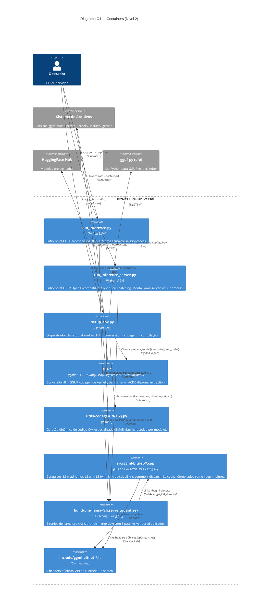

# C4 Nível 2 — Containers (BitNet CPU-Universal)

> Gerado pelo Reversa Architect | 2026-06-06 | doc_level: completo
> Diagramas em Mermaid. Confiança: 🟢 CONFIRMADO (containers, tech) | 🟡 INFERIDO (alguns fluxos)

---

## 1. Diagrama

🟢 CONFIRMADO para todos os containers e relações (inventory.md, modules.json, code-analysis.md).

---

## 2. Tabela de Containers

| Container | Tecnologia | Responsabilidade | LOC | Estado |
|-----------|-----------|------------------|----:|--------|
| `cli` (run_inference.py) | Python 3.9+ | Entry point CLI CPU | 55 | 🟢 produção |
| `server` (run_inference_server.py) | Python 3.9+ | Entry point HTTP OpenAI-compatible | 64 | 🟢 produção |
| `setup` (setup_env.py) | Python 3.9+ | Orquestrador de setup completo | 244 | 🟢 produção |
| `utils_py` (utils/*) | Python + numpy/scipy/safetensors | Conversão, codegen, bench, scripts | ~8.189 | 🟢 produção |
| `codegen` (utils/codegen_tl{1,2}.py) | Python puro | Geração dinâmica de kernels TL1/TL2 | ~600 | 🟢 produção |
| `kernels_cpp` (src/*.cpp) | C++17 + AVX2/NEON | 7 kernels L1-L5 + common + dispatch | ~2.585 | 🟢 produção |
| `dispatch_h` (include/*.h) | C++ headers | 9 headers públicos | ~921 | 🟢 produção |
| `llama_bin` (build/bin/*) | C++17 binary (Clang 18) | Runtime llama.cpp com 3 patches | (do submodule) | 🟢 produção |

🟢 CONFIRMADO via `wc -l` em `inventory.md`.

---

## 3. Tecnologias por Camada

| Camada | Tecnologia | Versão | Restrição |
|--------|-----------|--------|-----------|
| **Linguagem Python** | CPython | 3.9+ | Mínima declarada em README |
| **Linguagem C++** | C++17 | — | Templates complexos nos kernels gerados |
| **Compilador** | Clang | ≥ 18 | Obrigatório (ADR-002); GCC com `-fpermissive` |
| **Build system** | CMake | ≥ 3.22 | CLAUDE.md declara mínimo 3.22 |
| **Backend de inferência** | llama.cpp (fork) | branch `merge-dev` | Submodule; 3 patches vendored |
| **Tokenização** | tiktoken (Llama 3 BPE) | herdado | Legado upstream; fork sem `gpu/tokenizer.py` |
| **Quantização de modelos** | llama-quantize | herdado | Binário compilado in-tree |
| **Modelo de dados** | GGUF v3 | binário | Formato proprietário do llama.cpp |
| **HuggingFace CLI** | huggingface-cli | latest | Para download de modelos |
| **Gerenciador de ambiente** | conda | latest | Recomendado (README) |

🟢 CONFIRMADO.

---

## 4. Comunicação entre Containers

| Origem → Destino | Mecanismo | Protocolo | Frequência |
|------------------|-----------|-----------|------------|
| CLI → llama_bin | subprocess.run | argv + stdin/stdout | 1× por invocação |
| Server → llama_bin | subprocess.run | argv + stdin/stdout | 1× por invocação |
| setup → codegen | subprocess.run + argparse | argv | 1× por setup |
| setup → llama_bin | subprocess.run | argv | 1× por setup (compilação + quantização) |
| utils_py → fs | open()/numpy.save | POSIX | streaming (chunks de ~1 GB) |
| codegen → fs | write() | POSIX | 1× por setup |
| kernels_cpp → dispatch_h | #include | C++ | tempo de compilação |
| llama_bin → dispatch_h | #include (após patches) | C++ | tempo de compilação |
| llama_bin → kernels_cpp | target_link_libraries | CMake | link-time |

🟢 CONFIRMADO.

---

## 5. Persistência (Containers com estado)

Nenhum container Python mantém estado em memória entre invocações (são scripts). O único container com estado é `llama_bin`, que mantém:

- **KV cache** em memória GPU/CPU durante inferência (tamanho proporcional a `n_layers × n_kv_heads × seq_len × head_dim`).
- **Estado de sampling** (RNG seed, logit accumulator).
- **Ponteiros para o GGUF** carregado (read-only após load).

🟢 CONFIRMADO (state-machines.md fluxo 2).

---

## 6. Containers Removidos vs Upstream

| Container | Upstream microsoft/BitNet | Fork peder1981/BitNet |
|-----------|--------------------------|----------------------|
| `gpu/model.py` | ✅ | ❌ |
| `gpu/generate.py` | ✅ | ❌ |
| `gpu/tokenizer.py` | ✅ | ❌ |
| `gpu/pack_weight.py` | ✅ | ❌ |
| `gpu/convert_checkpoint.py` | ✅ | ❌ |
| `gpu/convert_safetensors.py` | ✅ | ❌ |
| `gpu/sample_utils.py` | ✅ | ❌ |
| `gpu/stats.py` | ✅ | ❌ |
| `kernels_cpp/L2-L5` | ❌ (só L1) | ✅ (L1-L5) |

🟢 CONFIRMADO via `git log --diff-filter=D` no fork e inspeção de `ls gpu/` (inexistente).

---

## 7. Dependências Externas (Containers Importam)

| Container | Dependência | Origem | Obrigatório? |
|-----------|-------------|--------|--------------|
| `setup` | huggingface-cli | PyPI / HF | Sim (download) |
| `setup` | cmake | apt / brew | Sim (compilação) |
| `setup` | clang ≥ 18 | apt | Sim (build) |
| `setup` | ninja-build | apt | Opcional (recomendado) |
| `setup` | gguf-py | pip (3rdparty/llama.cpp) | Sim (conversão) |
| `utils_py` | numpy | PyPI | Sim (benchmarks, conversão) |
| `utils_py` | scipy | PyPI | Sim (WHT/Hadamard) |
| `utils_py` | safetensors | PyPI | Sim (leitura de HF checkpoints) |
| `kernels_cpp` | libstdc++-14-dev | apt | Sim (compat Clang 18) |
| `cli`, `server` | (stdlib only) | — | — |

🟢 CONFIRMADO.
