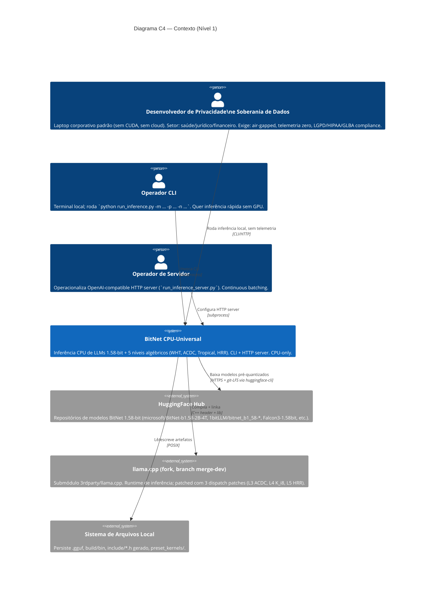

# C4 Nível 1 — Contexto (BitNet CPU-Universal)

> Gerado pelo Reversa Architect | 2026-06-06 | doc_level: completo
> Diagramas em Mermaid. Confiança: 🟢 CONFIRMADO (containers) | 🟡 INFERIDO (personas D4 herdadas do forward 001)

---

## 1. Diagrama

🟢 CONFIRMADO (containers, integração); 🟡 INFERIDO (personas D4 — adicionadas pelo `001-trilha-rigor-produto`).

---

## 2. Personas

### 2.1 Persona A — Desenvolvedor de Privacidade e Soberania de Dados 🟢 CONFIRMADO (cross-folder, decisão D4 forward)

| Atributo | Valor |
|----------|-------|
| **Contexto** | Setor regulado (saúde, jurídico, financeiro). LGPD/HIPAA/GLBA compliance obrigatório. |
| **Hardware típico** | Laptop corporativo padrão, sem GPU dedicada, sem cloud. |
| **Restrições** | Sem CUDA/sem cloud; telemetria zero; boot air-gapped aceitável. |
| **Necessidade** | Inferência local de LLMs 1.58-bit com qualidade aceitável. Privacidade por construção. |
| **Por que BitNet CPU-Universal** | 1.58-bit = modelo pequeno, CPU-only, telemetria zero por default. |
| **Trade-off aceito** | Velocidade inferior a GPU em workloads grandes, em troca de soberania total. |

**Origem**: Decisão D4 do `001-trilha-rigor-produto/requirements.md v2 §3.4` (2026-06-06), cross-validada com `gap-analysis.md` e `continuity-proposals.md`. Reclassificada 🟡→🟢 em 2026-06-06 (decisão D-Reviewer-4) com nota de proveniência cross-folder: a confirmação é forte o suficiente para dispensar o status de "inferência cross-folder" — a D4 está registrada, validada e cross-referenciada em documentos oficiais.

### 2.2 Persona B — Operador CLI 🟢 CONFIRMADO

| Atributo | Valor |
|----------|-------|
| **Contexto** | Desenvolvedor/researcher rodando inferência one-off no terminal. |
| **Hardware típico** | Linux/macOS/Windows com conda. x86_64 ou arm64. |
| **Necessidade** | Inferência rápida, sem servidor, sem estado. |
| **Entry point** | `python run_inference.py -m models/X/ggml-model-i2_s.gguf -p "..." -n 200 -t 4` |

### 2.3 Persona C — Operador de Servidor 🟢 CONFIRMADO

| Atributo | Valor |
|----------|-------|
| **Contexto** | Deploy OpenAI-compatible em máquina com HTTP acessível. |
| **Hardware típico** | Servidor x86_64 ou workstation arm64. |
| **Necessidade** | Continuous batching, n_predict=4096, host/port configuráveis. |
| **Entry point** | `python run_inference_server.py -m ... --host 0.0.0.0 --port 8080` |

---

## 3. Sistemas Externos

### 3.1 HuggingFace Hub 🟢 CONFIRMADO

- **Modelos suportados** (ver `setup_env.py:SUPPORTED_HF_MODELS`):
  - `1bitLLM/bitnet_b1_58-large`
  - `1bitLLM/bitnet_b1_58-3B`
  - `HF1BitLLM/Llama3-8B-1.58-100B-tokens`
  - `tiiuae/Falcon3-{1B,3B,7B,10B}-{Instruct,Base}-1.58bit`
  - `microsoft/BitNet-b1.58-2B-4T`
  - `tiiuae/Falcon-E-{1B,3B}-{Instruct,Base}`
- **Protocolo**: HTTPS + git-LFS via `huggingface-cli download`.
- **Direção**: pull-only.

### 3.2 llama.cpp (fork submodule) 🟢 CONFIRMADO

- **Origem**: fork de `ggerganov/llama.cpp`, branch custom `merge-dev`.
- **Pointer**: `1f86f05` (commit fixo no fork).
- **Modificações**: 3 patches vendored em `patches/llama.cpp/` (L3 ACDC, L4 K_i8 cache, L5 HRR cleanup). Aplicados idempotentemente por `scripts/apply-dispatch-patches.sh`.
- **Direção**: read + patch (após aplicar, NÃO modificar in-place).

### 3.3 Sistema de Arquivos Local 🟢 CONFIRMADO

- **O que persiste**:
  - `models/<name>/ggml-model-{i2_s|tl1|tl2}.gguf` — modelos quantizados
  - `models/<name>/*.safetensors` — checkpoint HF original
  - `build/bin/llama-{cli,server,quantize}` — binários compilados
  - `include/bitnet-lut-kernels.h` — kernels TL1/TL2 gerados (codegen)
  - `preset_kernels/<model>/` — kernels pré-tunados (3 modelos)
- **Convenção de paths**: `~/.cache/huggingface/` para HF; `models/` local para GGUF.
- **Permissões**: leitura/escrita pelo usuário que rodou setup_env.py.

---

## 4. Fronteira de Responsabilidade

| Quem | Responsabilidade | Não-responsabilidade |
|------|------------------|---------------------|
| **BitNet CPU-Universal** (este fork) | Kernels C++ L1-L5; CLI/HTTP wrappers; conversão HF→GGUF; testes; CI | Treinamento de modelos; serving production-grade multi-tenant; telemetria |
| **HuggingFace Hub** | Hospedagem de checkpoints pré-treinados | Disponibilidade, versionamento, integridade |
| **llama.cpp** (fork) | Runtime de inferência; KV cache; sampling; scheduling | Quantização ternária (delega ao BitNet) |
| **Sistema de arquivos** | Persistência | — |
| **CUDA / GPU** | **NÃO É USADO** (restrição do fork) | Aceleração de hardware |

🟢 CONFIRMADO exceto "telemetria zero" (🟡 INFERIDO D4 forward).

---

## 5. Relação com Upstream

| Aspecto | Upstream microsoft/BitNet | Fork peder1981/BitNet |
|---------|--------------------------|----------------------|
| **GPU pipeline (`gpu/`)** | ✅ Presente (PyTorch + CUDA) | ❌ Removido |
| **CPU kernels (L1 I2_S/TL1/TL2)** | ✅ | ✅ (mantido) |
| **L2 WHT / L3 ACDC / L4 Tropical / L5 HRR** | ❌ | ✅ Adicionados (pesquisa) |
| **3rdparty/llama.cpp** | Submódulo upstream | Fork (branch `merge-dev`) |
| **Patches vendored** | 0 | 3 (idempotentes) |
| **Target** | Produção dual-backend | Pesquisa CPU-only |
| **Telemetria** | (não documentado) | Zero por default (D4) |

🟢 CONFIRMADO via CLAUDE.md + inventory.md.
