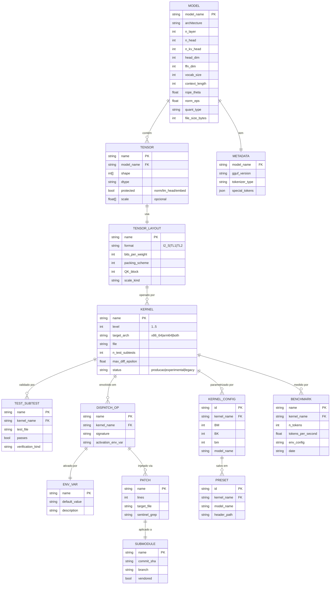

# ERD Completo — Modelo de Dados (BitNet CPU-Universal)

> Gerado pelo Reversa Architect | 2026-06-06 | doc_level: completo
>
> **Nota de fork**: Este projeto **NÃO usa banco de dados relacional**. O "modelo de dados" é a estrutura do arquivo **GGUF** (modelo de pesos quantizados) + as entidades de configuração de kernel (BM, BK, bm) + o estado de dispatch. Este ERD descreve essas entidades de forma relacional-equivalente para fins de rastreabilidade e impacto.

---

## 1. Diagrama Entidade-Relacionamento



🟢 CONFIRMADO para Model/Tensor/Metadata (data-dictionary.md); 🟡 INFERIDO para Kernel/Dispatch/Patch/EnvVar (mapeamento via gap-analysis.md, principles.md, context-summary).

---

## 2. Detalhamento das Entidades

### 2.1 MODEL 🟢 CONFIRMADO

Representa um arquivo GGUF carregado para inferência.

| Atributo | Tipo | Descrição | Fonte |
|----------|------|-----------|-------|
| `model_name` (PK) | string | Nome HuggingFace (`microsoft/BitNet-b1.58-2B-4T`) | `setup_env.py:SUPPORTED_HF_MODELS` |
| `architecture` | string | "llama" (BitNet herda arquitetura Llama) | GGUF metadata |
| `n_layer` | int | Camadas transformer (30 para 2B) | data-dictionary.md `ModelArgs` |
| `n_head` | int | Cabeças Q (20 para 2B) | data-dictionary.md |
| `n_kv_head` | int | Cabeças KV (5 para 2B, GQA=4) | data-dictionary.md |
| `head_dim` | int | 128 para 2B | data-dictionary.md |
| `ffn_dim` | int | 6912 para 2B | data-dictionary.md |
| `vocab_size` | int | 128256 (Llama 3) | data-dictionary.md |
| `context_length` | int | 4096 (default) | `ModelArgs.block_size` |
| `rope_theta` | float | 500000.0 (Llama 3) | data-dictionary.md |
| `norm_eps` | float | 1e-5 | data-dictionary.md |
| `quant_type` | string | "i2_s" / "tl1" / "tl2" | `setup_env.py:SUPPORTED_QUANT_TYPES` |
| `file_size_bytes` | int | Tamanho do .gguf (~1.18 GB para 2B i2_s) | 🟡 INFERIDO |

**Cardinalidade**: 1 MODEL tem 1 METADATA, 1 MODEL tem N TENSOR.

### 2.2 METADATA 🟢 CONFIRMADO

| Atributo | Tipo | Descrição |
|----------|------|-----------|
| `model_name` (FK) | string | FK para MODEL |
| `gguf_version` | string | Versão do formato GGUF (v3) |
| `tokenizer_type` | string | "llama3" (BPE tiktoken) |
| `special_tokens` | json | Map de tokens especiais |

### 2.3 TENSOR 🟢 CONFIRMADO

| Atributo | Tipo | Descrição | Exemplo (BitNet-2B) |
|----------|------|-----------|---------------------|
| `name` (PK) | string | Caminho no GGUF | `layers.0.attention.wqkv.weight` |
| `model_name` (FK) | string | FK para MODEL | `BitNet-b1.58-2B-4T` |
| `shape` | int[] | Dimensões | `[2560+512+512, 2560]` |
| `dtype` | string | "I2_S" / "F32" / "F16" | "I2_S" |
| `protected` | bool | Nunca quantiza (norm/lm_head/embed) | true para `norm.weight` |
| `scale` | float[] | Escalas per-tensor ou per-row (opcional) | `[s]` para I2_S |

**Tensores protegidos** (NUNCA quantizados, RN-001):
- `*.norm.weight` (F32)
- `lm_head.weight` (F32/F16)
- `embed_tokens.weight` (F32 default; F16 com `--quant-embd`)

**Cardinalidade**: N TENSOR por MODEL; cada TENSOR usa 1 TENSOR_LAYOUT.

### 2.4 TENSOR_LAYOUT 🟢 CONFIRMADO

| Atributo | Tipo | Descrição |
|----------|------|-----------|
| `name` (PK) | string | "I2_S_x86" / "I2_S_ARM" / "TL1" / "TL2" |
| `format` | enum | I2_S / TL1 / TL2 |
| `bits_per_weight` | int | 2 (I2_S, TL1, TL2) |
| `packing_scheme` | int | 4 (4 valores por byte) |
| `QK_block` | int | 128 (x86) / 64 (ARM) |
| `scale_kind` | string | "per_tensor" (I2_S) / "per_tensor" (TL1/TL2) |

### 2.5 KERNEL 🟢 CONFIRMADO

| Atributo | Tipo | Descrição | Exemplo |
|----------|------|-----------|---------|
| `name` (PK) | string | Nome do componente C++ | "ggml-bitnet-fwht" |
| `level` | int | Nível algébrico (1..5) | 3 para ACDC |
| `target_arch` | enum | "x86_64" / "arm64" / "both" | "both" para ACDC |
| `file` | string | Path no repo | `src/ggml-bitnet-fwht.cpp` |
| `n_test_subtests` | int | Subtests PASS | 5 para ACDC |
| `max_diff_epsilon` | float | Erro numérico máximo verificado | 1.3e-16 para ACDC |
| `status` | enum | "producao" / "experimental" / "legacy" | "experimental" para L2-L5 |

### 2.6 TEST_SUBTEST 🟢 CONFIRMADO

| Atributo | Tipo | Descrição |
|----------|------|-----------|
| `name` (PK) | string | Nome do subtest |
| `kernel_name` (FK) | string | FK para KERNEL |
| `test_file` | string | `test_acdc.cpp`, `test_wht.cpp`, etc. |
| `passes` | bool | Resultado |
| `verification_kind` | string | "max_diff" / "exact_recovery" / "naive_vs_residual" |

**Total atual**: 50/50 subtests PASS em 9 arquivos (test_bitnet_common, test_wht, test_acdc, test_tropical, test_sparse_attention, test_kv_i8_cache, test_hrr_cleanup, test_hrr_attention, test_extract_acdc_diagonal).

### 2.7 KERNEL_CONFIG 🟢 CONFIRMADO

| Atributo | Tipo | Descrição |
|----------|------|-----------|
| `id` (PK) | string | "bitnet_b1_58-3B_x86_i2s" |
| `kernel_name` (FK) | string | FK para KERNEL |
| `BM` | int | Block size M (ex: 160) |
| `BK` | int | Block size K (ex: 96) |
| `bm` | int | Tile size (ex: 32) |
| `model_name` | string | Modelo alvo |

**Mapeamento atual** (ver `setup_env.py` + `code-analysis.md` módulo 3):
- bitnet_b1_58-3B (x86): BM=160, BK=96, bm=32
- BitNet-b1.58-2B-4T: igual ao 3B (D-10, 🟡 INFERIDO — pode ser intencional)
- bitnet_b1_58-large: BM=256, BK=96, bm=32
- Llama3-8B-1.58-100B-tokens: BM=256, BK=96, bm=32

### 2.8 PRESET 🟢 CONFIRMADO

| Atributo | Tipo | Descrição |
|----------|------|-----------|
| `id` (PK) | string | Nome do preset |
| `kernel_name` (FK) | string | FK para KERNEL |
| `model_name` | string | Modelo |
| `header_path` | string | `preset_kernels/<model>/bitnet-lut-kernels-tl1.h` |

**Presets existentes** (ver `preset_kernels/`):
- `bitnet_b1_58-3B`
- `bitnet_b1_58-large`
- `Llama3-8B-1.58-100B-tokens`

### 2.9 DISPATCH_OP 🟢 CONFIRMADO

| Atributo | Tipo | Descrição |
|----------|------|-----------|
| `name` (PK) | string | "bitnet_op_tropical_attn" |
| `kernel_name` (FK) | string | FK para KERNEL |
| `signature` | string | Assinatura C++ |
| `activation_env_var` | string | "BITNET_TROPICAL_TOPK" |

**Ops registradas** (`ggml-bitnet-dispatch.h`):
- `bitnet_op_acdc_gemv` → `BITNET_ACDC_FFN`
- `bitnet_op_tropical_attn` → `BITNET_TROPICAL_TOPK`
- `bitnet_op_hrr_attn` → `BITNET_HRR_ATTN`
- `bitnet_op_hrr_attn_with_cleanup` → `BITNET_HRR_ATTN_CLEANUP`
- `bitnet_op_sparse_attention_float` (opt-in) → `BITNET_SPARSE_TOPK`

### 2.10 ENV_VAR 🟢 CONFIRMADO

| Nome | Default | Descrição |
|------|---------|-----------|
| `BITNET_ACDC_FFN` | (unset → desabilitado) | Habilita ACDC no FFN |
| `BITNET_TROPICAL_TOPK` | (unset → softmax real) | K para tropical top-K |
| `BITNET_HRR_ATTN` | (unset → atenção padrão) | Habilita HRR na atenção |
| `BITNET_HRR_ATTN_CLEANUP` | 8 (se HRR_ATTN=1) | Iterações Frady 2021 RESIDUAL |
| `BITNET_SPARSE_TOPK` | (unset → dense) | Opt-in sparse float attention |
| `NO_CUDA_GRAPHS` | (unset) | Escape hatch CUDA Graphs (legado GPU) |

### 2.11 PATCH 🟢 CONFIRMADO

| Atributo | Tipo | Descrição |
|----------|------|-----------|
| `name` (PK) | string | "01-L3-ACDC-FFN-dispatch" |
| `lines` | int | Tamanho do patch |
| `target_file` | string | `3rdparty/llama.cpp/src/llama.cpp` |
| `sentinel_grep` | string | Padrão para detecção de aplicação |

**Patches atuais** (`patches/llama.cpp/`):
- `01-L3-ACDC-FFN-dispatch.patch` (162 linhas)
- `02-L5-HRR-cleanup-dispatch.patch` (16 linhas)
- `03-L4-TROPICAL-KI8-cache.patch` (12 linhas)

### 2.12 SUBMODULE 🟢 CONFIRMADO

| Atributo | Tipo | Descrição |
|----------|------|-----------|
| `name` (PK) | string | "3rdparty/llama.cpp" |
| `commit_sha` | string | `1f86f05` (pointer fixo) |
| `branch` | string | "merge-dev" |
| `vendored` | bool | true (fork custom) |

### 2.13 BENCHMARK 🟡 INFERIDO

| Atributo | Tipo | Descrição |
|----------|------|-----------|
| `name` (PK) | string | "smoke_n64_l4_tropical" |
| `kernel_name` (FK) | string | FK para KERNEL |
| `n_tokens` | int | Tokens gerados |
| `tokens_per_second` | float | Medição |
| `env_config` | string | Env vars usados |
| `date` | string | Data da medição |

**Benchmarks existentes** (`utils/`):
- `wht_benchmark.py` (L2)
- `acdc_benchmark.py` (L3)
- `tropical_benchmark.py` (L4)
- `hrr_benchmark.py` (L5)
- `e2e_benchmark.py` (end-to-end)
- `cpu_universal_benchmark.py` (L1-L5 sistemático)
- `test_perplexity.py`

---

## 3. Cardinalidades e Restrições

```
MODEL (1) ──── (1) METADATA
   │
   └── (N) TENSOR ──── (1) TENSOR_LAYOUT
                          │
                          │ usado por
                          ▼
                       (N) KERNEL ──── (N) TEST_SUBTEST
                          │                  ▲
                          │                  │ valida
                          ├── (N) KERNEL_CONFIG ── (1) PRESET
                          │
                          ├── (N) DISPATCH_OP ──── (1) ENV_VAR
                          │
                          └── (N) BENCHMARK

PATCH (N) ──── (1) SUBMODULE
```

🟢 CONFIRMADO para todas as cardinalidades (mapeamento via data-dictionary.md, gap-analysis.md, modules.json).

---

## 4. Invariantes do Modelo

| # | Invariante | Onde | Consequência se violada |
|---|------------|------|------------------------|
| I-01 | Tensores com `protected=true` (norm/lm_head/embed) nunca em I2_S/TL1/TL2 | `convert-hf-to-gguf-bitnet.py:795` | `suit_i2 = False` |
| I-02 | `n_head % n_kv_head == 0` (GQA válido) | `gpu/model.py:211` (legado) | AssertionError |
| I-03 | `dim % n_head == 0` | `gpu/model.py:204` (legado) | AssertionError |
| I-04 | `vocab_size > 0` | `gpu/model.py:249` (legado) | AssertionError |
| I-05 | `nrow % 4 == 0` para I2_S sem ACT_PARALLEL | `ggml-bitnet-mad.cpp:98` | Assert |
| I-06 | Cache KV `>= length` | `gpu/model.py:364` (legado) | Assert em `cache_prefix` |
| I-07 | Tokenizer existe | `gpu/tokenizer.py:52` (legado) | Assert com path |
| I-08 | `acdc_forward_i8` é **unnormalized** (sem 1/n²) | `ggml-bitnet-fwht.cpp:291-303` | Bug latente; corrigido em `ed6fbde` |
| I-09 | `hrr_cleanup_iter` com M=NULL → NAIVE; M!=NULL → RESIDUAL | `ggml-bitnet-hrr.h` | Comportamento indefinido |
| I-10 | K_i8 cache scale locked on first call | `ggml-bitnet-kv-cache.cpp` | Inconsistência (D-08) |

🟢 CONFIRMADO.

---

## 5. Conformidade com 16 RNs (Regras de Negócio)

| RN | Reflete Entidade | Status |
|----|-------------------|--------|
| RN-001 (tensores protegidos) | TENSOR.protected | 🟢 |
| RN-002 (embed F16 com TL) | TENSOR_LAYOUT.scale_kind | 🟢 |
| RN-003 (arch → formats) | MODEL.quant_type + ENV_VAR.arch | 🟢 |
| RN-004 (nrow % 4) | I-05 | 🟢 |
| RN-005 (dual-model GPU) | N/A (fork sem GPU) | ⚠ legacy |
| RN-006 (prompt padding) | N/A (fork sem GPU) | ⚠ legacy |
| RN-007 (Clang obrigatório) | BUILD | 🟢 |
| RN-008 (ngl 0 hardcoded) | CLI | 🟢 |
| RN-009 (b 1 hardcoded) | CLI | 🟢 |
| RN-010 (ternário {0,1,2}) | TENSOR_LAYOUT | 🟢 |
| RN-011 (torch.load vuln) | N/A (fork sem GPU) | ⚠ legacy |
| RN-012 (base-3 TL1/TL2) | TENSOR_LAYOUT | 🟢 |
| RN-013 (absmax médio) | quant_weight_* | 🟢 |
| RN-014 (NO_CUDA_GRAPHS) | ENV_VAR | ⚠ legacy |
| RN-015 (capture_error_mode) | N/A (fork sem GPU) | ⚠ legacy |
| RN-016 (tokenizer fingerprint) | METADATA.tokenizer_type | 🟢 |

🟢 CONFIRMADO exceto 5 RNs legacy marcadas ⚠ (todas em `gpu/` upstream que o fork removeu).
