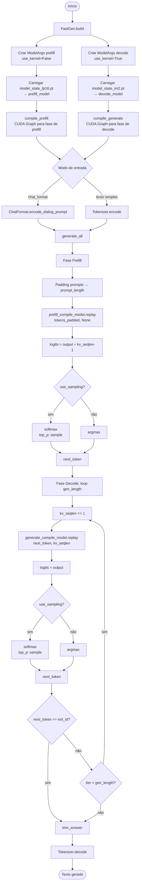
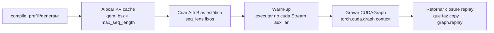

# Fluxograma — Pipeline de Inferência GPU

> Reversa Archaeologist | 2026-05-03

## Fluxo principal: `FastGen.build` → `generate_all`

```mermaid
flowchart TD
    A([Início]) --> B[FastGen.build]
    B --> B1[Criar ModelArgs prefill\nuse_kernel=False]
    B --> B2[Criar ModelArgs decode\nuse_kernel=True]
    B1 --> C[Carregar model_state_fp16.pt\n→ prefill_model]
    B2 --> D[Carregar model_state_int2.pt\n→ decode_model]
    C --> E[compile_prefill\nCUDA Graph para fase de prefill]
    D --> F[compile_generate\nCUDA Graph para fase de decode]
    E --> G{Modo de entrada}
    F --> G
    G -->|chat_format| H[ChatFormat.encode_dialog_prompt]
    G -->|texto simples| I[Tokenizer.encode]
    H --> J[generate_all]
    I --> J

    J --> K[Fase Prefill]
    K --> K1[Padding prompts → prompt_length]
    K1 --> K2[prefill_compile_model.replay\ntokens_padded, None]
    K2 --> K3[logits = output ÷ kv_seqlen-1]
    K3 --> K4{use_sampling?}
    K4 -->|sim| K5[softmax\ntop_p: sample]
    K4 -->|não| K6[argmax]
    K5 --> L[next_token]
    K6 --> L

    L --> M[Fase Decode: loop gen_length]
    M --> M1[kv_seqlen += 1]
    M1 --> M2[generate_compile_model.replay\nnext_token, kv_seqlen]
    M2 --> M3[logits = output]
    M3 --> M4{use_sampling?}
    M4 -->|sim| M5[softmax\ntop_p: sample]
    M4 -->|não| M6[argmax]
    M5 --> M7[next_token]
    M6 --> M7
    M7 --> M8{next_token == eot_id?}
    M8 -->|não| M9{iter < gen_length?}
    M9 -->|sim| M1
    M8 -->|sim| N[trim_answer]
    M9 -->|não| N

    N --> O[Tokenizer.decode]
    O --> P([Texto gerado])
```

## Fluxo de compilação com CUDA Graph

```mermaid
flowchart LR
    A[compile_prefill/generate] --> B[Alocar KV cache\ngem_bsz × max_seq_length]
    B --> C[Criar AttnBias estática\nseq_lens fixos]
    C --> D[Warm-up\nexecutar no cuda.Stream auxiliar]
    D --> E[Gravar CUDAGraph\ntorch.cuda.graph context]
    E --> F[Retornar closure replay\nque faz copy_ + graph.replay]
```
