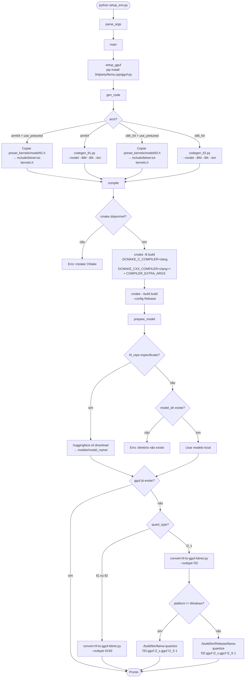
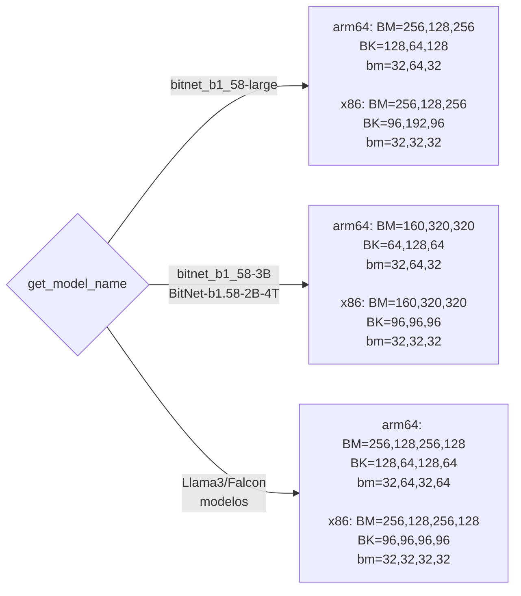

# Fluxograma — Setup do Ambiente (setup_env.py)

> Reversa Archaeologist | 2026-05-03

## Pipeline principal

```mermaid
flowchart TD
    A([python setup_env.py]) --> B[parse_args]
    B --> C[main]
    C --> D[setup_gguf\npip install 3rdparty/llama.cpp/gguf-py]
    D --> E[gen_code]
    E --> F{arch?}
    F -->|arm64 + use_pretuned| G[Copiar preset_kernels/model/tl1.h\n→ include/bitnet-lut-kernels.h]
    F -->|arm64| H[codegen_tl1.py\n--model --BM --BK --bm]
    F -->|x86_64 + use_pretuned| I[Copiar preset_kernels/model/tl2.h\n→ include/bitnet-lut-kernels.h]
    F -->|x86_64| J[codegen_tl2.py\n--model --BM --BK --bm]
    G --> K[compile]
    H --> K
    I --> K
    J --> K

    K --> K1{cmake disponível?}
    K1 -->|não| ERR1[Erro: instalar CMake]
    K1 -->|sim| K2[cmake -B build\n-DCMAKE_C_COMPILER=clang\n-DCMAKE_CXX_COMPILER=clang++\n+ COMPILER_EXTRA_ARGS]
    K2 --> K3[cmake --build build\n--config Release]
    K3 --> L[prepare_model]

    L --> L1{hf_repo especificado?}
    L1 -->|sim| L2[huggingface-cli download\n→ models/model_name/]
    L1 -->|não| L3{model_dir existe?}
    L3 -->|não| ERR2[Erro: diretório não existe]
    L3 -->|sim| L4[Usar modelo local]
    L2 --> L5{gguf já existe?}
    L4 --> L5
    L5 -->|sim| DONE([Pronto])
    L5 -->|não| L6{quant_type?}
    L6 -->|tl1 ou tl2| L7[convert-hf-to-gguf-bitnet.py\n--outtype tl1/tl2]
    L6 -->|i2_s| L8[convert-hf-to-gguf-bitnet.py\n--outtype f32]
    L8 --> L9{platform != Windows?}
    L9 -->|sim| L10[./build/bin/llama-quantize\nf32.gguf i2_s.gguf I2_S 1]
    L9 -->|não| L11[./build/bin/Release/llama-quantize\nf32.gguf i2_s.gguf I2_S 1]
    L7 --> DONE
    L10 --> DONE
    L11 --> DONE
```

## Seleção de parâmetros GEMM por modelo

```mermaid
flowchart LR
    A{get_model_name} -->|bitnet_b1_58-large| B[arm64: BM=256,128,256\nBK=128,64,128\nbm=32,64,32\n\nx86: BM=256,128,256\nBK=96,192,96\nbm=32,32,32]
    A -->|bitnet_b1_58-3B\nBitNet-b1.58-2B-4T| C[arm64: BM=160,320,320\nBK=64,128,64\nbm=32,64,32\n\nx86: BM=160,320,320\nBK=96,96,96\nbm=32,32,32]
    A -->|Llama3/Falcon\nmodelos| D[arm64: BM=256,128,256,128\nBK=128,64,128,64\nbm=32,64,32,64\n\nx86: BM=256,128,256,128\nBK=96,96,96,96\nbm=32,32,32,32]
```
