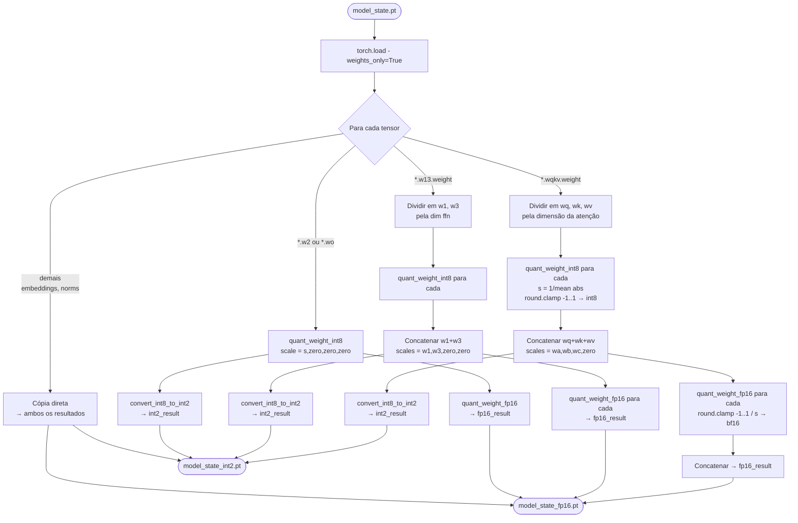
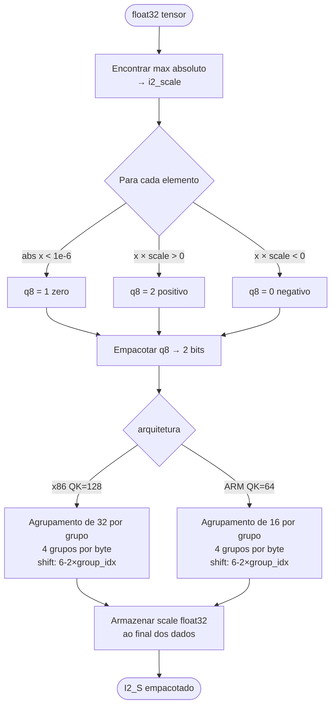

# Fluxograma — Quantização de Pesos

> Reversa Archaeologist | 2026-05-03

## Pipeline de conversão de checkpoint GPU



## Empacotamento para GPU: `convert_weight_int8_to_int2`

```mermaid
flowchart LR
    A([weight int8\n{-1, 0, +1}]) --> B[+2 shift\n→ {1, 2, 3}]
    B --> C[permutate_weight_fastest\nReordena blocos 16×32\npara layout WMMA shared mem]
    C --> D[compress_int2_to_int8\n4 valores de 2 bits\npor byte via bitwise OR]
    D --> E[interleave_weight_int8\nReinterpreta como int32\nreordena bits internos\npara padrão WMMA]
    E --> F[reshape → N × K//4]
    F --> G([weight empacotado\nint8])
```

## Quantização I2_S para CPU: `quantize_i2_s`


