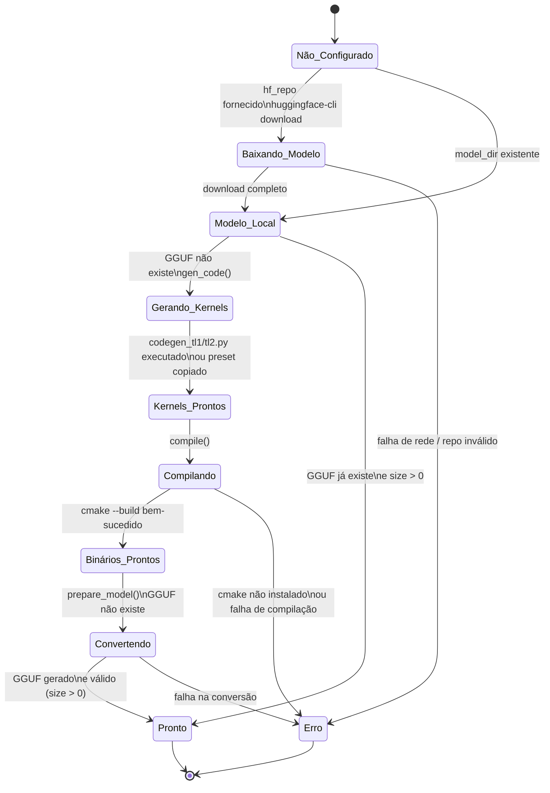
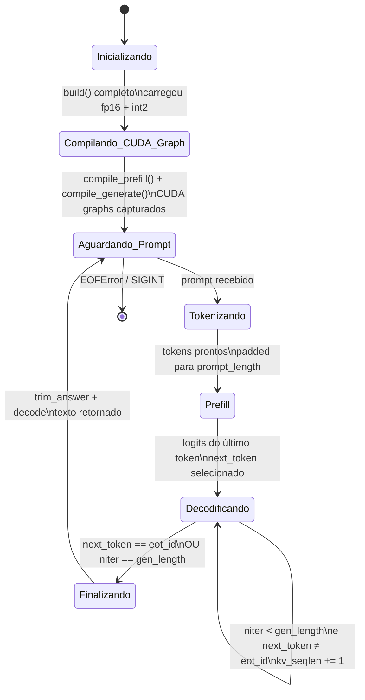
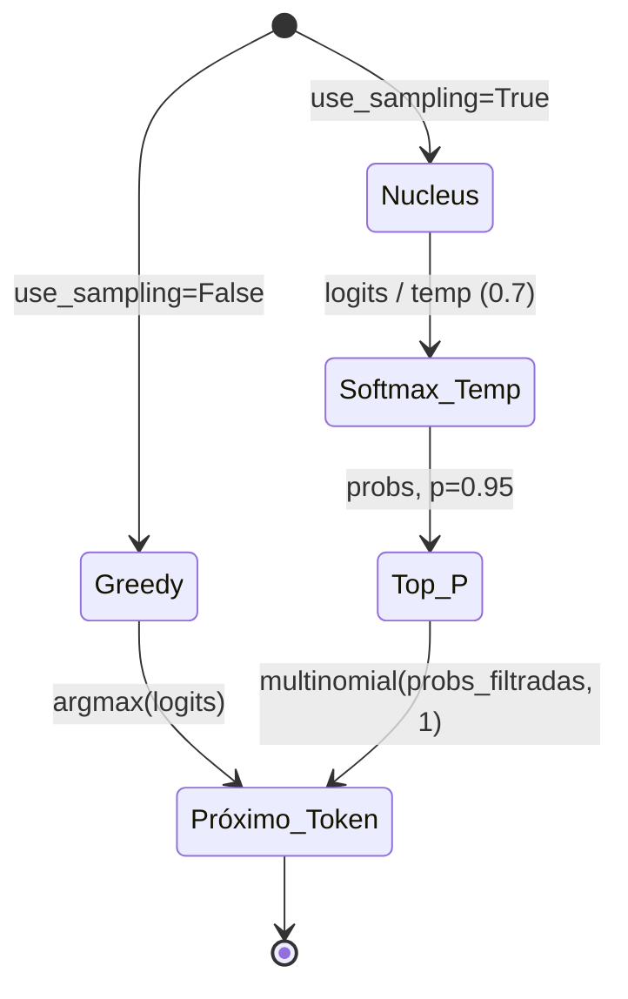
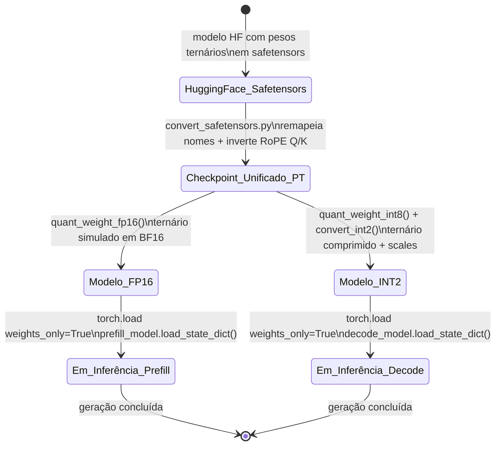
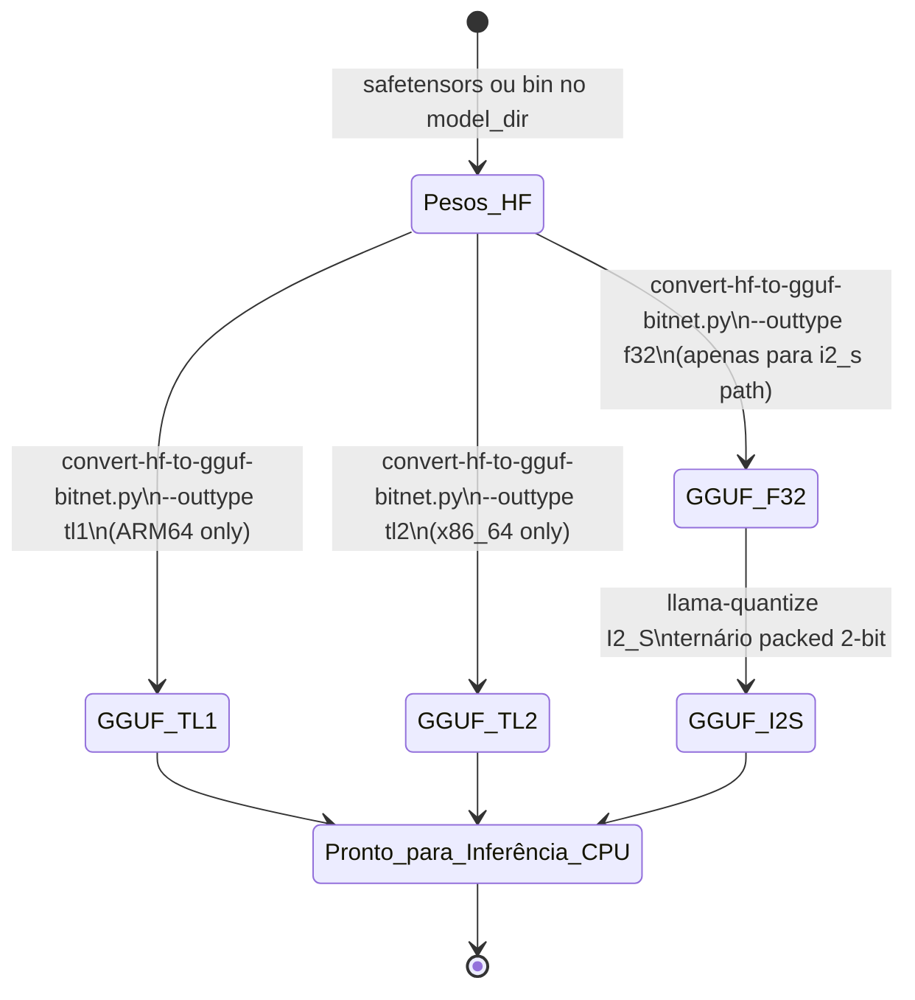

# Máquinas de Estado — BitNet

> Gerado pelo Reversa Detective | 2026-05-03

---

## 1. Pipeline de Setup do Ambiente

Estado da preparação do ambiente para inferência. Representado implicitamente pelo estado do filesystem e pelos artefatos gerados.

**Estados:**

| Estado | Condição no Filesystem |
|--------|----------------------|
| `Não_Configurado` | Nenhum artefato local |
| `Modelo_Local` | `model_dir/` existe com pesos HF |
| `Kernels_Prontos` | `include/bitnet-lut-kernels.h` existe |
| `Binários_Prontos` | `build/bin/llama-cli` existe |
| `Pronto` | `model_dir/ggml-model-{type}.gguf` existe e `size > 0` |

**Nota:** O sistema não persiste estado explicitamente — rederiva o estado atual verificando a existência dos artefatos. 🟡 INFERIDO

---

## 2. Ciclo de Vida da Geração de Texto (GPU)

Estados da geração em `FastGen.generate_all`.

**Transições de estado de sampling:**

---

## 3. Ciclo de Vida do Checkpoint GPU

Transições dos formatos de arquivo durante a preparação do modelo GPU.

---

## 4. Pipeline de Conversão CPU (HF → GGUF)

**Regra de roteamento:**

| Plataforma | Tipo de quantização | Path de conversão |
|------------|-------------------|------------------|
| ARM64 | `tl1` | Direto HF → TL1 GGUF |
| ARM64 | `i2_s` | HF → F32 GGUF → I2_S GGUF (2 passos) |
| x86_64 | `tl2` | Direto HF → TL2 GGUF |
| x86_64 | `i2_s` | HF → F32 GGUF → I2_S GGUF (2 passos) |

**Motivo dos 2 passos para I2_S:** O `llama-quantize` precisa de um modelo F32 como entrada; não consegue quantizar diretamente de BF16/F16. 🟡 INFERIDO
