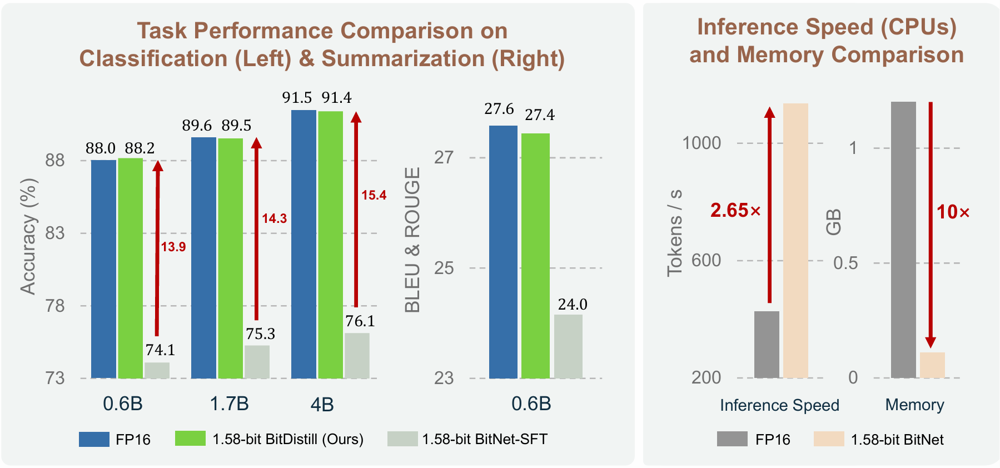

# BitNet Distillation

[](https://arxiv.org/abs/2510.13998)



Official implementation of "**BitNet Distillation**".
BitNet Distillation (BitDistill), a lightweight pipeline that fine-tunes off-the-shelf full-precision LLMs (e.g., Qwen) into 1.58-bit precision (i.e., ternary weights {-1, 0, 1}) for specific downstream tasks, achieving strong task-specific performance with minimal computational cost.

Specifically, BitDistill incorporates three key techniques: the SubLN mod
ule, as introduced in BitNet; multi-head attention distillation, based
on MiniLM; and continual pre-training, which serves as a crucial
warm-up step to mitigate the scalability issue of the performance gap between
finetuned full-precision and 1.58-bit LLMs on specific tasks. Experimental re
sults show that BitDistill achieves performance comparable to the full
precision counterpart models across model size, while enabling up to 10×
memory savings and 2.65× faster inference on CPUs.


## Getting Started

### Data Preparation
Please refer to the dataset format used by [LLaMA-Factory](https://github.com/hiyouga/LlamaFactory/blob/main/data/README.md) for checking the details about the format of dataset files.

### Clone the repo

```
git clone --recursive https://github.com/microsoft/BitNet.git
cd BitNet/bitdistill
```
### Install the dependencies

#### For AMD ROCm users:

1. Please use docker: `rocm/pytorch:rocm6.4.1_ubuntu24.04_py3.12_pytorch_release_2.5.1`

```
docker run -it --privileged --net=host --ipc=host --rm -v $(pwd):$(pwd) -w $(pwd) rocm/pytorch:rocm6.4.1_ubuntu24.04_py3.12_pytorch_release_2.5.1 bash
```
2. Setup the dependencies
```
bash ./scripts/rocm_setup.sh
```

#### For CUDA users:

1. Please use docker: `yushuiwx/rl:v2.0.2`

```
docker run --privileged --net=host --ipc=host --gpus=all -v $(pwd):$(pwd) -w $(pwd) -it yushuiwx/rl:v2.0.2
```
2. Setup the dependencies
```
bash ./scripts/cuda_setup.sh
```

## Training Commands

```
bash qwen3-exp.sh
```

* for training fp16 baseline on downstream task:
    * $lr: learning rate
    * $model: Qwen model name
    * $gpu: gpu index for training
```
bash ds-exp-run-sft-baseline.sh $lr $model $gpu
```

* for training deepseekdistill bitdistill on downstream task using fp16 baseline as teacher:

    * $teacher: local path for fp16 huggingface-format teacher model
    * $beta: loss weight for logits distillation
    * $minilmweight: loss weight for minilm v2 distillation
    * $distilllayer: use which layer to apply minilm v2 distillation
```
bash ds-exp-run-sft-bitdistill.sh $lr $model $gpu $teacher $beta $minilmweight $distilllayer  
```
## Citation
If this work is helpful, please kindly cite as:
```
@article{wu2025bitnet,
  title={BitNet Distillation},
  author={Wu, Xun and Huang, Shaohan and Wang, Wenhui and Song, Ting and Dong, Li and Xia, Yan and Wei, Furu},
  journal={arXiv preprint arXiv:2510.13998},
  year={2025}
}
```
## Acknowledgements

This repo benefits from [LLaMA-Factory](https://github.com/hiyouga/LlamaFactory/blob/main) and [transformers](https://github.com/huggingface/transformers.git). Thanks for their wonderful works.