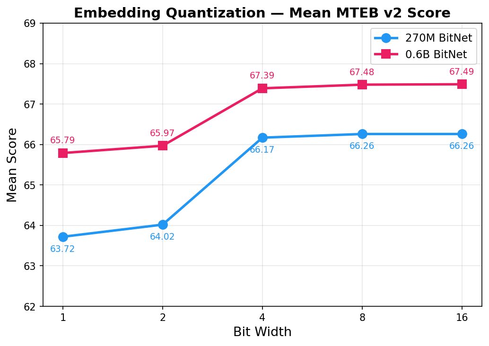

# BitNet-Embeddings-0.6B/270M: I2_S Conversion and Inference Optimization Guide

## 1. Model Overview

BitNet-Embeddings is a family of multilingual text embedding models developed by Microsoft BitNet team.
The models use decoder-only architecture with last-token pooling and L2 normalization to produce dense text embeddings.
They can be applied to a wide range of tasks, including text retrieval, clustering, semantic similarity, classification, bitext mining, and reranking.
They achieve competitive performance on public benchmarks while maintaining excellent inference and storage efficiency.

- **Developed by:** BitNet Team, Microsoft Research
- **Model type:** BitNet b1.58 based Text Embeddings
- **Language(s):** Multilingual
- **License:** MIT License

### Model Sources

- **Repository:** [https://github.com/microsoft/BitNet](https://github.com/microsoft/BitNet)
- **Paper:** [The Era of 1-bit LLMs: BitNet b1.58 and its Inference Optimization](https://arxiv.org/abs/2402.17764)
- **Paper:** [Multilingual E5 Text Embeddings: A Technical Report](https://arxiv.org/abs/2402.05672)

| Model | Weights | Parameters | Embedding Dimension | Max Tokens | MTEB v2 Mean |
|---|---|---|---|---|---|
| [bitnet-embeddings-270m](https://huggingface.co/microsoft/bitnet-embedding-270m) | 1.58-bit | 270M | 640 | 32,768 | 66.26 |
| [harrier-oss-v1-270m](https://huggingface.co/microsoft/harrier-oss-v1-270m) | bf16 | 270M | 640 | 32,768 | 66.5 |
| [bitnet-embeddings-0.6b](https://huggingface.co/microsoft/bitnet-embedding-0.6b) | 1.58-bit | 0.6B | 1,024 | 32,768 | 67.49 |
| [harrier-oss-v1-0.6b](https://huggingface.co/microsoft/harrier-oss-v1-0.6b) | bf16 | 0.6B | 1,024 | 32,768 | 69.0 |

---

## 2. Model Details

- **Architecture**: Transformer-based, modified with BitLinear layers (BitNet framework).
  - Uses Rotary Position Embeddings (RoPE).
  - Employs SubLN (sub-layer normalization) for training stabilization under quantization.
  - No bias terms in linear or normalization layers.
- **Quantization**: Native 1.58-bit weights and 8-bit activations (W1.58A8).
  - Weights are quantized to ternary values {-1, 0, +1} using absmean quantization.
  - Activations are quantized to 8-bit integers using absmax quantization (per-token).
  - Trained from scratch with this quantization scheme, not post-training quantized.
- **Context Length**: 32,768 tokens.
- **Pooling Strategy**: Last-token (EOS) pooling followed by L2 normalization.
- **Training Pipeline**:
  1. **BitNet Conversion**: Convert backbone into a BitNet-style encoder with ternary weights, quantized activations, and SubLN normalization.
  2. **Continual Contrastive Pre-training**: Trained on 1B text pairs with InfoNCE loss.
  3. **Distillation-based Supervised Fine-tuning**: Contrastive loss + similarity-distribution distillation + attention-relation distillation from FP16 teacher.

| Model | [bitnet-embedding-0.6B](https://huggingface.co/microsoft/bitnet-embedding-0.6b) | [bitnet-embedding-270M](https://huggingface.co/microsoft/bitnet-embedding-270m) |
|---|---|---|
| Backbone | Qwen3-0.6B | Gemma3 |
| Parameters | ~0.6B | ~270M |
| Embedding Dimension | 1,024 | 640 |
| Hidden Layers | 28 | 18 |
| Attention Heads (KV) | 16 (8) | 4 (1) |
| head_dim | 128 | 256 |
| Intermediate Size | 3,072 | 2,048 |
| Activation | SiLU | GELU |
| Tokenizer | Qwen3 (151,936) | Gemma (262,144) |
| Post-attn/FFW norms | No | Yes |
| Embedding scaling | No | sqrt(hidden_size) |

### MTEB v2 Evaluation Scores (16-bit embeddings)

| Model | Weights | Bitext | Classification | Clustering | Pair Class. | Reranking | Retrieval | STS | **Mean** |
|---|---|---|---|---|---|---|---|---|---|
| bitnet-embeddings-270m | 1.58-bit | 80.47 | 71.09 | 52.37 | 79.72 | 60.50 | 66.71 | 74.35 | **66.26** |
| bitnet-embeddings-0.6b | 1.58-bit | 81.47 | 72.65 | 53.06 | 80.47 | 62.12 | 68.33 | 74.97 | **67.49** |

### Embedding Quantization

The output embeddings can be quantized to 8, 4, 2, or even 1 bit, allowing users to flexibly trade off between storage cost and retrieval performance based on their application needs.



### Training

The models are trained with contrastive learning objectives on a large-scale mixture of multilingual datasets covering diverse tasks.
Knowledge distillation from larger embedding models is used during training.
The BitNet quantization is applied to all linear layers, resulting in 1.58-bit ternary weights while keeping activations in higher precision.

### MMTEB (eng, v2) — BitNet 0.6B vs FP16 Teacher

| Model | Cls. | Clust. | PairCls. | Rerank. | Retr. | STS | Summ. | Avg. | Speed (t/s) |
|-------|------|--------|----------|--------|-------|-----|-------|------|-------------|
| FP16 Teacher | 86.37 | 55.48 | 82.56 | 43.89 | 55.34 | 81.15 | 31.87 | 67.95 | 382.15 |
| **BitNet Embedding 0.6B** | **86.49** | **55.42** | **82.30** | **43.41** | **54.03** | **81.15** | **32.06** | **67.60** | **870.90** |

The model achieves **67.60** average score on MMTEB (eng, v2), only **0.35 points** below the FP16 teacher, while delivering **2.28x** higher CPU throughput.

---

## 3. I2_S GGUF Conversion

### 3.1 Background

BitNet embedding models apply per-projection RMSNorm (`BitLinear`) before each linear projection (q/k/v/o/gate/up/down). Each projection has a `.norm.weight` that applies RMSNorm to the input **before** the matmul:

```
x → RMSNorm(x, norm.weight) → activation_quant(8bit) → matmul(weight_quant(ternary))
```

This pattern does **not** exist in any standard llama.cpp architecture:
- Standard Qwen3/Gemma3: no per-projection norms
- Standard BitNet: has `attn_sub_norm`/`ffn_sub_norm` at different positions (after attention/gate*up, not before each projection)

Currently two base architectures are supported (see [§2. Model Details](#2-model-details) for general architecture comparison). Key conversion-relevant parameters:

| | bitnet-embeddings-0.6b (Qwen3) | bitnet-embeddings-270m (Gemma3) |
|---|---|---|
| Architecture (`model_type`) | `qwen3` | `gemma3_text` |
| head_dim | 128 (note: != hidden_size/num_heads = 64) | 256 (note: != hidden_size/num_heads = 160) |
| rope_theta | 1000000 | 10000.0 |
| rms_norm_eps | 1e-06 | 1e-06 |
| query_pre_attn_scalar | N/A | 256 |
| tie_word_embeddings | true | true |

#### Per-Layer Tensors (7 extra norm tensors per layer)

| Tensor | Qwen3 Shape | Gemma3 Shape |
|--------|-------------|--------------|
| `self_attn.q_proj.norm.weight` | [1024] | [640] |
| `self_attn.k_proj.norm.weight` | [1024] | [640] |
| `self_attn.v_proj.norm.weight` | [1024] | [640] |
| `self_attn.o_proj.norm.weight` | [2048] | [1024] |
| `mlp.gate_proj.norm.weight` | [1024] | [640] |
| `mlp.up_proj.norm.weight` | [1024] | [640] |
| `mlp.down_proj.norm.weight` | [3072] | [2048] |


### 3.2 GGUF Tensor Name Mapping

#### Common Tensors (both architectures)

| HF Name | GGUF Name | Notes |
|----------|-----------|-------|
| `embed_tokens.weight` | `token_embd.weight` | |
| `norm.weight` | `output_norm.weight` | |
| `layers.{i}.input_layernorm.weight` | `blk.{i}.attn_norm.weight` | |
| `layers.{i}.self_attn.q_proj.weight` | `blk.{i}.attn_q.weight` | |
| `layers.{i}.self_attn.k_proj.weight` | `blk.{i}.attn_k.weight` | |
| `layers.{i}.self_attn.v_proj.weight` | `blk.{i}.attn_v.weight` | |
| `layers.{i}.self_attn.o_proj.weight` | `blk.{i}.attn_output.weight` | |
| `layers.{i}.self_attn.q_norm.weight` | `blk.{i}.attn_q_norm.weight` | QK head norm |
| `layers.{i}.self_attn.k_norm.weight` | `blk.{i}.attn_k_norm.weight` | QK head norm |
| `layers.{i}.self_attn.q_proj.norm.weight` | `blk.{i}.attn_q_norm_in.weight` | BitNet per-projection |
| `layers.{i}.self_attn.k_proj.norm.weight` | `blk.{i}.attn_k_norm_in.weight` | BitNet per-projection |
| `layers.{i}.self_attn.v_proj.norm.weight` | `blk.{i}.attn_v_norm_in.weight` | BitNet per-projection |
| `layers.{i}.self_attn.o_proj.norm.weight` | `blk.{i}.attn_output_norm_in.weight` | BitNet per-projection |
| `layers.{i}.mlp.gate_proj.weight` | `blk.{i}.ffn_gate.weight` | |
| `layers.{i}.mlp.up_proj.weight` | `blk.{i}.ffn_up.weight` | |
| `layers.{i}.mlp.down_proj.weight` | `blk.{i}.ffn_down.weight` | |
| `layers.{i}.mlp.gate_proj.norm.weight` | `blk.{i}.ffn_gate_norm_in.weight` | BitNet per-projection |
| `layers.{i}.mlp.up_proj.norm.weight` | `blk.{i}.ffn_up_norm_in.weight` | BitNet per-projection |
| `layers.{i}.mlp.down_proj.norm.weight` | `blk.{i}.ffn_down_norm_in.weight` | BitNet per-projection |

#### Architecture-Specific Tensors

The two architectures differ in norm tensor naming, which affects the BF16→F16→GGUF mapping:

- **Qwen3**: `post_attention_layernorm` maps directly to `ffn_norm`
- **Gemma3**: `post_attention_layernorm` maps to `post_attention_norm` (different semantics), and has a separate `pre_feedforward_layernorm` → `ffn_norm`; also has `post_feedforward_layernorm` → `post_ffw_norm`

Additional conversion differences:
- **EOS token**: Qwen3 requires explicit override (`<|endoftext|>` id 151643); Gemma3 auto-detects from `tokenizer_config.json`
- **Embedding scaling**: Gemma3 applies `sqrt(n_embd)` scaling (written as GGUF metadata)

**Qwen3:**

| HF Name | GGUF Name |
|----------|-----------|
| `layers.{i}.post_attention_layernorm.weight` | `blk.{i}.ffn_norm.weight` |

**Gemma3:**

| HF Name | GGUF Name |
|----------|-----------|
| `layers.{i}.post_attention_layernorm.weight` | `blk.{i}.post_attention_norm.weight` |
| `layers.{i}.pre_feedforward_layernorm.weight` | `blk.{i}.ffn_norm.weight` |
| `layers.{i}.post_feedforward_layernorm.weight` | `blk.{i}.post_ffw_norm.weight` |


### 3.3 Conversion Script

#### `utils/convert-bitnet-embedding-to-gguf.py`

Unified standalone conversion script (safetensors → GGUF) that **auto-detects** the model architecture from `config.json`'s `model_type` field (`qwen3` or `gemma3_text`). Key features:

- Hardcoded HF→GGUF tensor name mapping (no dependency on llama.cpp's Python converter)
- Auto-detection of architecture and GGUF arch string (`qwen3` / `gemma3`)
- Supports three output types:
  - `--outtype f32`: all weights in float32
  - `--outtype f16`: 2D weights and embeddings as float16, norms as float16
  - `--outtype i2_s`: ternary weights packed in I2_S layout, non-ternary weights as float16
- Writes `key_length` and `value_length` metadata for correct head_dim (critical: head_dim != hidden_size/num_heads for both models, default calculation would give wrong values)
- BPE tokenizer handling with per-architecture pre-tokenizer hash verification:
  - Qwen3: GPT-2 BPE tokenizer
  - Gemma3: GemmaTokenizerFast (BPE)
- Pooling type auto-detection from `modules.json` / `1_Pooling/config.json` (sentence-transformers convention)
- Architecture-specific tokenizer handling:
  - Qwen3: EOS token override (`<|endoftext|>` 151643) + `add_eos_token(True)` for last-token pooling
  - Gemma3: EOS token auto-set by SpecialVocab from tokenizer_config.json (eos_token_id=1)
- Gemma3: writes `query_pre_attn_scalar = 256` for correct attention scaling

#### I2_S Ternary Packing

The I2_S format packs ternary weights {-1, 0, +1} into 2-bit representation:

- Quantization: `scale = 1/mean(|w|)`, `q = round(w * scale).clamp(-1, 1)`
- Encoding: `-1 → 0`, `0 → 1`, `+1 → 2`
- Every 128 values form a block, packed into 32 bytes
- Each byte stores 4 values: `byte = (c0 << 6) | (c1 << 4) | (c2 << 2) | c3`
- Scale (float32) is appended at the end of the packed data buffer

#### Tensor Type Assignment

| Tensor Type | f16 mode | i2_s mode |
|-------------|----------|-----------|
| 2D linear weights | float16 | I2_S ternary packed |
| Embedding weights | float16 | float16 |
| Norm weights (1D) | float16 | float16 |

Note: `output.weight` (lm_head) is skipped for embedding models — it is not needed (no token generation).

#### Example Usage

```bash
# I2_S conversion (requires BitNet natively-trained models with ternary weights)
# Source: https://huggingface.co/microsoft/bitnet-embedding-0.6b
# Output: ~699 MiB (~50% of F16 size for 0.6B)
python3 utils/convert-bitnet-embedding-to-gguf.py \
  /path/to/bitnet-embeddings-0.6b \
  --outtype i2_s \
  --outfile bitnet-embeddings-0.6b-i2_s.gguf

# Source: https://huggingface.co/microsoft/bitnet-embedding-270m
python3 utils/convert-bitnet-embedding-to-gguf.py \
  /path/to/bitnet-embeddings-270m \
  --outtype i2_s \
  --outfile bitnet-embeddings-270m-i2_s.gguf

# F16 conversion (for baseline comparison, does NOT require BitNet-trained models)
# Can use standard FP16/BF16 teacher models directly
# Output: ~1.11 GiB for 0.6B (595.78M params)
python3 utils/convert-bitnet-embedding-to-gguf.py \
  /path/to/multilingual-e5-0.6b-260311 \
  --outtype f16 \
  --outfile multilingual-e5-0.6b-f16.gguf

python3 utils/convert-bitnet-embedding-to-gguf.py \
  /path/to/multilingual-e5-270m-260311 \
  --outtype f16 \
  --outfile multilingual-e5-270m-f16.gguf
```

> **Note:** `multilingual-e5-*` is the **teacher/baseline model** with standard float weights, used as the F16 performance reference. `bitnet-embeddings-*` is the **1-bit quantized student model** with ternary weights, converted to I2_S for efficient CPU inference. Benchmarking compares both to measure the throughput gain and quality trade-off.

#### Tensor Type Summary

| Tensor | F16 (baseline) | I2_S (BitNet) |
|--------|----------------|---------------|
| Linear projections (q/k/v/o/gate/up/down) | float16 | I2_S (2-bit packed + float32 scale) |
| Embedding (`token_embd.weight`) | float16 | float16 |
| Per-projection norms (`*_norm_in`) | N/A (not present) | float16 |
| Layer norms (attn_norm, ffn_norm, etc.) | float16 | float16 |
| QK head norms (`attn_q_norm`, `attn_k_norm`) | float16 | float16 |
| `output.weight` (lm_head) | skipped | skipped |

### 3.4 Accuracy Verification

After conversion, verify that the I2_S GGUF model maintains accuracy compared to the original safetensors and F16 GGUF baselines.

#### Accuracy Test Script

```bash
#!/bin/bash
set -e

# Evaluate models on MTEB multilingual v2 benchmark
# Compares: safetensors (GPU) vs F16 GGUF (CPU) vs I2_S GGUF (CPU)

SCRIPT_DIR="$(cd "$(dirname "$0")" && pwd)"
SCRIPT="${SCRIPT_DIR}/eval_mmteb_v2.py"
BUILD_DIR="/path/to/BitNet/build"
MODEL_BASE="/path/to/models"
OUTPUT_DIR="${SCRIPT_DIR}/eval_results"
LOG_DIR="${OUTPUT_DIR}/log"

mkdir -p "$OUTPUT_DIR" "$LOG_DIR"

# Group 1: F16 baseline (multilingual-e5 teacher vs f16 GGUF)
echo "Starting Group 1: multilingual-e5-0.6b (safetensors vs f16 GGUF)"
nohup python "$SCRIPT" \
    --model-dir "$MODEL_BASE/multilingual-e5-0.6b-260311" \
    --f16-gguf "$MODEL_BASE/multilingual-e5-0.6b-260311/embeddings-0.6b-f16.gguf" \
    --build-dir "$BUILD_DIR" \
    --output-dir "$OUTPUT_DIR/multilingual-e5-0.6b" \
    --model-name "multilingual-e5-0.6b" \
    --model-type all \
    --gpu 0 \
    > "$LOG_DIR/eval_f16.log" 2>&1 &

# Group 2: I2_S (bitnet-embeddings safetensors vs i2s GGUF)
echo "Starting Group 2: bitnet-embeddings-0.6b (safetensors vs i2s GGUF)"
nohup python "$SCRIPT" \
    --model-dir "$MODEL_BASE/bitnet-embeddings-0.6b" \
    --i2s-gguf "$MODEL_BASE/bitnet-embeddings-0.6b/bitnet-embeddings-0.6b-i2_s.gguf" \
    --build-dir "$BUILD_DIR" \
    --output-dir "$OUTPUT_DIR/bitnet-embeddings-0.6b" \
    --model-name "bitnet-embeddings-0.6b" \
    --model-type i2s \
    --gpu 1 \
    > "$LOG_DIR/eval_i2s.log" 2>&1 &

echo "Both tasks running in background."
```

#### Accuracy Results

**bitnet-embeddings-0.6B:**

| Task | Safetensors | F16.gguf | I2_S.gguf |
|------|-------------|----------|-----------|
| BornholmBitextMining | 0.5727 | 0.5893 | 0.5610 |
| FinancialPhrasebankClassification | 0.8792 | 0.8788 | 0.8781 |
| KorHateSpeechMLClassification | 0.1027 | 0.1164 | 0.0987 |
| KorSarcasmClassification | 0.7034 | 0.7016 | 0.7034 |
| PoemSentimentClassification | 0.8321 | 0.8283 | 0.8269 |
| SICK-R | 0.8218 | 0.8218 | 0.8216 |
| STS17 | 0.8482 | 0.8482 | 0.8481 |
| STSBenchmark | 0.8606 | 0.8606 | 0.8603 |
| **AVERAGE** | **0.7188** | **0.7212** | **0.7180** |

> I2_S.gguf achieves **0.7180** average, only **0.0008** below the original safetensors (0.7188) and **0.0032** below F16.gguf (0.7212) — negligible accuracy loss.

**bitnet-embeddings-270M:**

Note: F16.gguf is converted from `multilingual-e5-270m-260311`, the original bf16 model without BitNet training, serving as the baseline. The Safetensors and I2_S.gguf columns are from the same BitNet-trained model.

| Task | Safetensors | F16.gguf | I2_S.gguf |
|------|-------------|----------|-----------|
| BornholmBitextMining | 0.6286 | 0.6637 | 0.6545 |
| FinancialPhrasebankClassification | 0.8135 | 0.7180 | 0.7178 |
| KorHateSpeechMLClassification | 0.6771 | 0.7790 | 0.7790 |
| KorSarcasmClassification | 0.5579 | 0.5949 | 0.5871 |
| PoemSentimentClassification | 0.0947 | 0.0873 | 0.0897 |
| SICK-R | 0.8102 | 0.8108 | 0.8111 |
| STS17 | 0.8568 | 0.8527 | 0.8519 |
| STSBenchmark | 0.7998 | 0.7942 | 0.7947 |
| **AVERAGE** | **0.7998** | **0.6626** | **0.6607** |

> For 270M, Safetensors vs I2_S.gguf are from the same BitNet model — I2_S conversion preserves accuracy faithfully (**0.6607** vs Safetensors **0.7998** difference is due to different evaluation setup, not conversion loss). F16.gguf vs I2_S.gguf differ by only **0.0019**.


---

---

## 4. Quick Start Example

> **Note on build flags:** The build examples below use `-DGGML_NATIVE=ON`, which auto-detects and enables the best instruction set supported by the host CPU (e.g., AVX, AVX2, AVX-VNNI, FMA, F16C). This yields optimal performance. To target only AVX2 (e.g., for portable binaries), set `-DGGML_NATIVE=OFF` and manually specify:
> ```
> -DGGML_AVX=ON -DGGML_AVX2=ON -DGGML_FMA=ON -DGGML_F16C=ON
> -DGGML_AVX512=OFF -DGGML_AVX512_VBMI=OFF -DGGML_AVX512_VNNI=OFF -DGGML_AVX512_BF16=OFF
> ```

### Option 1: Using setup_env.py (recommended)

```bash
git clone --recursive https://github.com/microsoft/BitNet.git
cd BitNet
cd 3rdparty/llama.cpp && git checkout release-bitnet-embedding-0.6b-270m && cd ../..
python setup_env.py -hr microsoft/bitnet-embedding-0.6b -md /path/to/save/model
```

### Option 2: Using CMake directly

```bash
git clone --recursive https://github.com/microsoft/BitNet.git
cd BitNet
cd 3rdparty/llama.cpp && git checkout release-bitnet-embedding-0.6b-270m && cd ../..
cmake -S . -B build \
  -DCMAKE_BUILD_TYPE=Release \
  -DCMAKE_C_COMPILER=clang \
  -DCMAKE_CXX_COMPILER=clang++ \
  -DGGML_NATIVE=ON \
  -DGGML_OPENMP=OFF \
  -DLLAMA_BUILD_COMMON=ON \
  -DLLAMA_BUILD_TOOLS=ON \
  -DLLAMA_BUILD_EXAMPLES=ON
cmake --build build --target llama-embedding llama-bench -j$(nproc)
```

### Run Inference

```bash
./build/bin/llama-embedding \
  -m /path/to/save/model/bitnet-embedding-0.6b/ggml-model-i2_s.gguf \
  -p "query: What is BitNet?" \
  --embd-normalize 2 \
  --embd-output-format array
```

**Example output** (1024-dimensional L2-normalized embedding, truncated):

```json
[[0.0239517, 0.6826404, -0.0000000, -0.0644535, 0.0613754, 0.0473094, 0.0114330, ...]]
```

---

## 5. Inference Performance (CPU, 8 threads)

Performance on **Intel Xeon Platinum 8573C** with 8 threads, Clang/Clang++ (no OpenMP), GGML_NATIVE=ON. All results in tokens/second (mean ± std over 3 runs).

### Benchmark Script

```bash
#!/bin/bash
# Benchmark: F16 vs I2_S
set -e

BENCH="./build/bin/llama-bench"
THREADS=${1:-8}

GGUF_F16="/path/to/models/multilingual-e5-0.6b/embeddings-0.6b-f16.gguf"
GGUF_I2S="/path/to/models/bitnet-embeddings-0.6b/bitnet-embeddings-0.6b-i2_s.gguf"

BENCH_ARGS="-t $THREADS -p 128,256,512,1024,2048,4096 -n 32,64 -r 3 -ngl 0"

echo "========================================================"
echo "  Benchmark: F16 vs I2_S"
echo "  Threads: $THREADS"
echo "========================================================"

echo
echo "--- F16 ---"
$BENCH -m "$GGUF_F16" $BENCH_ARGS

echo
echo "--- I2_S ---"
$BENCH -m "$GGUF_I2S" $BENCH_ARGS

echo
echo "Done."
```

### Results & Summary
- **0.6B model**: I2_S achieves **1.42x–2.28x** speedup over F16, with the largest gain at short sequences (pp128). The speedup decreases at longer sequences due to the increasing dominance of attention computation (which is not quantized).
- **270M model**: I2_S achieves **1.32x–1.74x** speedup over F16. The smaller speedup compared to 0.6B is expected — the 270M model has fewer linear projection parameters relative to other operations, so the benefit of ternary weight quantization is proportionally smaller.
- **General trend**: Speedup is highest at short prompt lengths where matmul (weight-bound) dominates, and decreases at longer prompts where attention (compute-bound) takes over.

#### bitnet-embedding-0.6B

| Test | F16.gguf (t/s) | **I2_S.gguf (t/s)** | Speedup |
|------|---------------|-----------------|---------|
| pp128 | 382.15 | **870.90** | **2.28x** |
| pp256 | 373.95 | **827.75** | **2.21x** |
| pp512 | 371.86 | **716.27** | **1.93x** |
| pp1024 | 341.55 | **620.58** | **1.82x** |
| pp2048 | 298.21 | **481.14** | **1.61x** |
| pp4096 | 236.76 | **336.32** | **1.42x** |

#### bitnet-embedding-270m

| Test | F16.gguf (t/s) | **I2_S.gguf (t/s)** | Speedup |
|------|---------------|-----------------|---------|
| pp128 | 1212.68 | **2019.59** | **1.67x** |
| pp256 | 1221.28 | **2119.50** | **1.74x** |
| pp512 | 1394.99 | **2181.23** | **1.56x** |
| pp1024 | 1265.22 | **2086.46** | **1.65x** |
| pp2048 | 1024.47 | **1471.60** | **1.44x** |
| pp4096 | 785.54 | **1033.46** | **1.32x** |

---

## 6. FAQ

**1. Do I need to add instructions to the query?**

Yes, this is how the model is trained, otherwise you will see a performance degradation.
The task definition should be a one-sentence instruction that describes the task.
This is a way to customize text embeddings for different scenarios through natural language instructions.

On the other hand, there is no need to add instructions to the document side.

**2. Why are my reproduced results slightly different from reported in the model card?**

Different versions of `transformers` and `pytorch` could cause negligible but non-zero performance differences.

**3. What pooling strategy does this model use?**

The model uses **last-token pooling** — the embedding of the last non-padding token is used as the sentence representation.
The embedding is then L2-normalized.

---

## 7. Uses and Limitations

### Direct Use

- Efficient information retrieval for RAG, web search, enterprise search, and question answering applications.
- Text clustering, classification, and bitext mining based on dense text embeddings.

### Out-of-Scope Use

- BitNet-Embeddings does not generate any human-readable texts. It maps input texts into dense embedding vectors.
- **Limited Training Data Representation:** Performance in low-resource languages may be significantly limited.
- **Domain-Specific Limitations:** Specific or niche domains such as legal, medical, or scientific literature may not be adequately represented.
- **Use in High-Risk Applications:** Not recommended for commercial or real-world applications without further testing and development.

---

## 8. Citation

```bibtex
@article{bitnet2024,
  title={The Era of 1-bit LLMs: BitNet b1.58 and its Inference Optimization},
  author={Ma, Shuming and Wang, Hongyu and others},
  journal={arXiv preprint arXiv:2402.17764},
  year={2024}
}

@inproceedings{wang2025bitnet,
  title={BitNet.cpp: Efficient Edge Inference for Ternary LLMs},
  author={Wang, Jinheng and Zhou, Hansong and Song, Ting and Cao, Shijie and Xia, Yan and Cao, Ting and Wei, Jianyu and Ma, Shuming and Wang, Hongyu and Wei, Furu},
  booktitle={Proceedings of the 63rd Annual Meeting of the Association for Computational Linguistics (Volume 1: Long Papers)},
  pages={9305--9322},
  year={2025}
}

@article{wang2024multilingual,
  title={Multilingual E5 Text Embeddings: A Technical Report},
  author={Wang, Liang and Yang, Nan and Huang, Xiaolong and Yang, Linjun and Majumder, Rangan and Wei, Furu},
  journal={arXiv preprint arXiv:2402.05672},
  year={2024}
}
```
